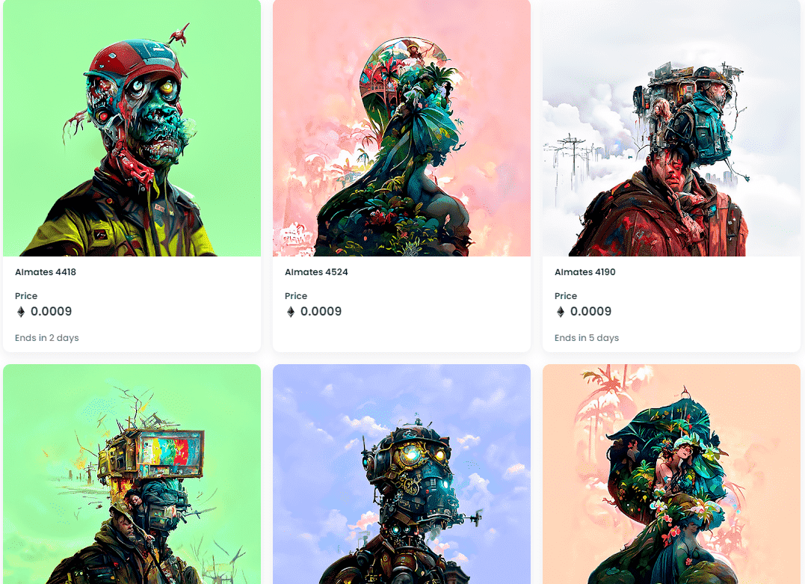

# AIGates

没有承诺，没有路线图，没有实用性……只有人工智能再生的灵长类动物

什么是 AImates？

AImates 是一个 NFT（不可替代代币）集合。存储在区块链上的数字艺术品集合。

有多少 AImates 代币？

总共有 9,993 个 AImates NFT。目前，2,407 位车主的钱包中至少有一个 AImates NTF。

什么是最昂贵的 AImates 销售？

售出的最昂贵的 AImates NFT 是 AImates 2。它于 2022 年 6 月 29 日（2 个月前）以 219.6 美元的价格售出。

最近卖出了多少AImates？

过去 30 天内共售出 689 个 AImates NFT。

AImates 的费用是多少？

过去 30 天，最便宜的 AImates NFT 销售额低于 1 美元，最高销售额超过 5 美元。在过去 30 天内，AImates NFT 的中位价格为 2 美元。

