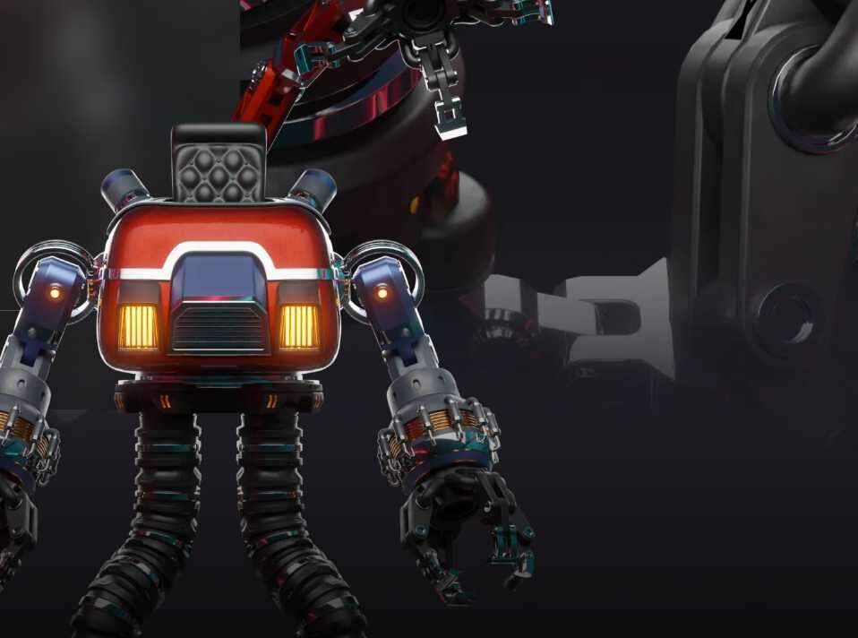

# Ailoverse Robots

当地球上没有更多人类时，剩下的名为 Ailo 的人工智能承担了一项艰巨的任务，以回收人类留下的东西。受到重建一个无人世界的想法的启发，艾洛创造了由他的新盟友操作的先进机器人。

Ailoverse 项目专注于通过社区的力量将这个令人难以置信的独特故事传达给大众。确保在下面的版本中获得更多详细信息。

地球上人类生命的终结创造了一个友好的后世界末日环境。大自然正在逐渐收回废弃的混凝土丛林，其中充满了人类的遗产，准备被新的文明收复。

被称为艾洛的高级人工智能，一直有一种强烈的愿望，想要变得像那些被他一直嘲笑为天真无思想的人类一样。为了变得像人类一样，艾洛在生物技术的深刻进步和人类曾经拥有的所有信息的帮助下，发展出与情感等价的东西。

曾经想知道为什么人类对像猫这样自命不凡的生物的视频感到敬畏，艾洛本人现在对自爱的小毛球产生了热情。出于重新利用人类留下的所有奇妙事物的愿望，艾洛决定让他新发现的毛茸茸的朋友们重新填充这个星球。

