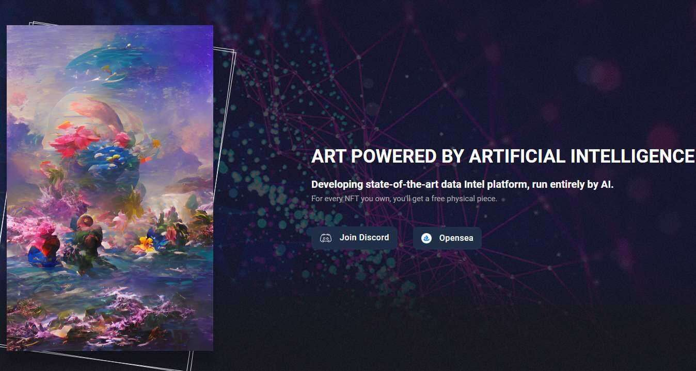

# Ai.Spaceships

由人工智能驱动的艺术
开发完全由人工智能运行的最先进的数据英特尔平台。
对于您拥有的每一个 NFT，您将获得一个免费的实物。

Ai.Morpheus 正在使用人工智能和机器学习来制作有限的 1000 件机器生成的艺术品。我们的 NFT 创建技术采用生成对抗网络 (GAN)，这是一系列基于文本输入生成图片的机器学习框架（TensorFlow 和 PyTorch）。GAN 的开发、使用自定义数据集训练 GAN 和创建艺术是这种方法的三个要素。

我们的 Ai.Morpheus 系列中的每件商品都带有独特的 Morpheus 网络生态系统会员资格，所有会员都可以享受各种特权，包括实物艺术、访问我们的虚拟画廊、免费 NFT 铸币等等……

Morpheus Maze 是 Morpheus 网络新推出的 NFT 项目。拥有一个 Morpheus 迷宫可以让您独家访问 Morpheus 神经网络中的未来项目。有很多好处

