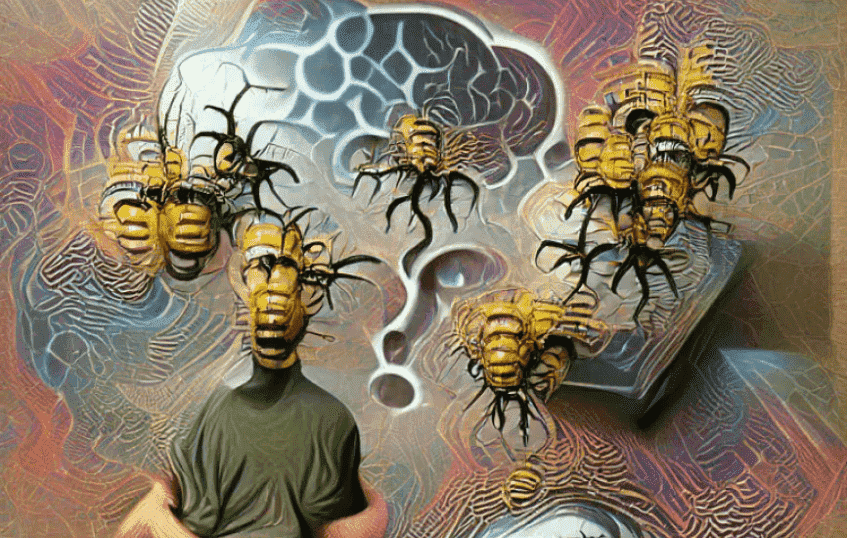

# AiVATAR

*艺术家 Trey Ratcliff 的一个生成艺术项目，探索我们与 AI 的关系*

您自己的个人 AiVATAR 研究了从亚里士多德到艾伦瓦茨的所有伟大哲学家的著作，并为一个会让您大吃一惊的狡猾问题提供了独特的答案。

这是著名艺术家 Trey Ratcliff 的一个生成式 NFT 艺术项目，他为这个项目创建了 6,000 个基于哲学人工智能的化身，对 6,000 个问题产生了 6,000 个独特的回答。通过这个令人费解的过程，你的 AiVATAR 已经形成了他们自己的、完全独特的反应，这意味着没有人知道这些 AI 在他们被铸造时会说什么，或者他们未来的艺术作品会是什么样子。

作为您自己的 AI 艺术家（第 2 阶段及以后）的所有者，您将有能力生成独特的数字艺术作品，用于铸造新的 NFT 或用于任何其他目的。他们将由您随心所欲。潜力真的是无限的。我们和你一样兴奋地看到接下来会发生什么......

