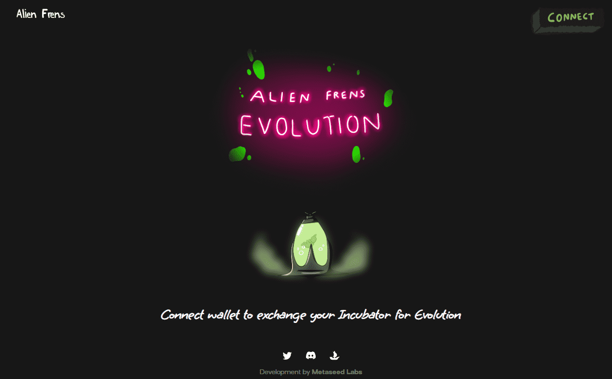

# Alien Frens Incubator

Alien Frens Incubator NFT 在过去 7 天内售出 26 次。Alien Frens Incubator 的总销售额为 4.43 万美元。一个 Alien Frens Incubator NFT 的平均价格为 170.6 美元。有 3,769 名 Alien Frens 孵化器所有者，总共拥有 1 个代币。

孵化器被烧毁创造外星人进化NFT

▶ 什么是外星人弗伦斯孵化器？

Alien Frens Incubator 是一个 NFT（非同质代币）集合。存储在区块链上的数字艺术品集合。

▶ 存在多少 Alien Frens Incubator 代币？

总共有 1 个 Alien Frens Incubator NFT。目前，3,769 名所有者的钱包中至少有一个 Alien Frens 

Incubator NTF。

▶ Alien Frens 孵化器最昂贵的销售是什么？

出售的最昂贵的 Alien Frens Incubator NFT 是 Alien Frens Incubator。它于 2022-06-08（3 个月

前）以 873.3 美元的价格售出。

