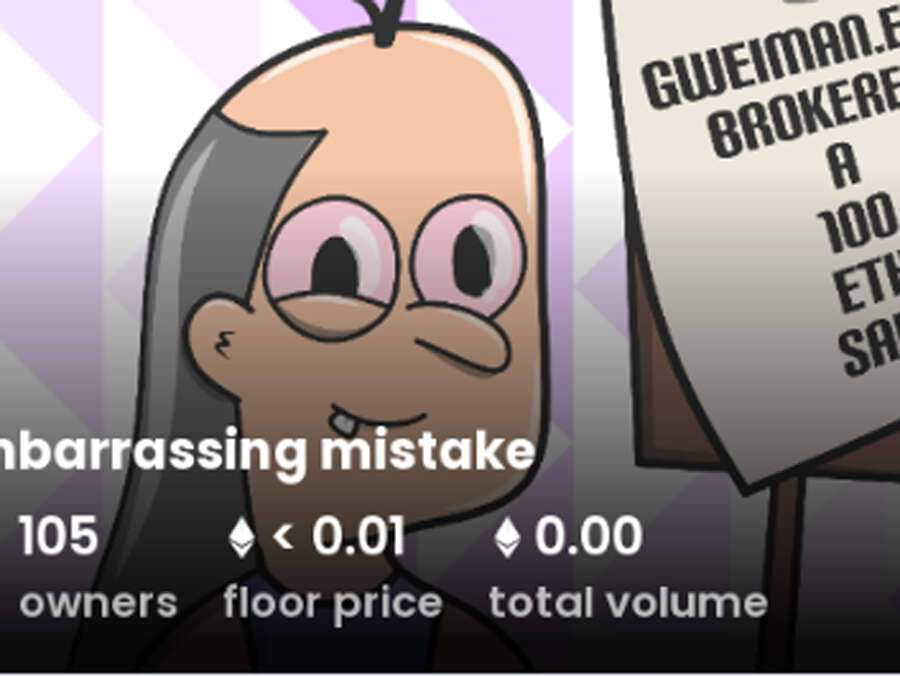

# An embarrassing mistake

ENS 历史上最大的失败可能发生在昨天，当时富兰克林在一个毫无价值的域名上花费了 100 eth。我们制作这个系列是为了让这个重要的日子永远不会被忘记……没有路线图，没有承诺，但我们掌握了一些技巧。2022 年 7 月 22 日首次出现了一个令人尴尬的错误。我们目前正在追踪 836 一个尚未被销毁或质押的流通中令人尴尬的错误代币。我们为一个令人尴尬的错误索引了 59 个独特的特征对。最常见的购买地点 令人尴尬的错误包括 OpenSea 和 LooksRare 等市场或 Gem.xyz 和 Genie.xyz 等聚合器。链接可以在上面找到！

