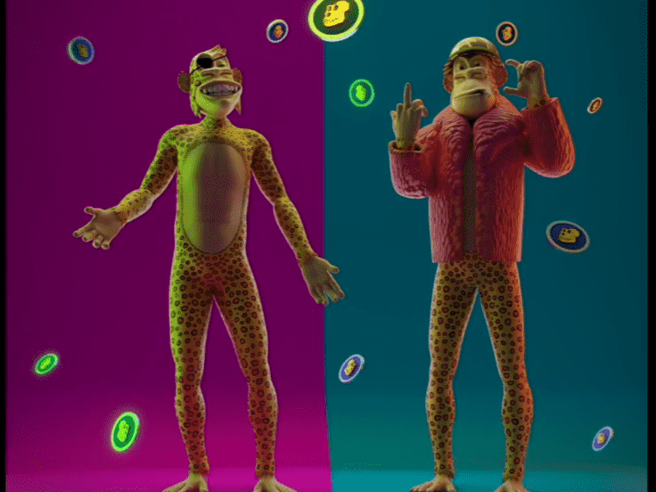

# Ape Drops 03 : An 8th

##### ▶ 什么是 Ape Drops 03 : An 8th？

Ape Drops 03 : An 8th 是 NFT (Non-fungible token) 集合。存储在区块链上的数字艺术品集合。

##### ▶ How many Ape Drops 03 : 8th token 存在？

总共有 8 Ape Drops 03 : An 8th NFTs。目前，775 位所有者的钱包中至少有一个 Ape Drops 03 : An 8th NTF。

##### ▶ 什么是最贵的 Ape Drops 03 : An 8th sale？

最昂贵的 Ape Drops 03: An 8th NFT 是 Temperature。它于 2022-06-07（3 个月前）以 145.1 美元的价格售出。

##### ▶ Ape Drops 03 : An 8th 最近卖了多少？

有 34 Ape Drops 03：过去 30 天内售出的第 8 个 NFT。

##### ▶ Ape Drops 03 : An 8th 多少钱？

最近 30 天，最便宜的 Ape Drops 03 : An 8th NFT 销售额低于 20 美元，最高销售额超过 110 美元。Ape Drops 03 : An 8th NFT 在过去 30 天内的中位价格为 44 美元。
