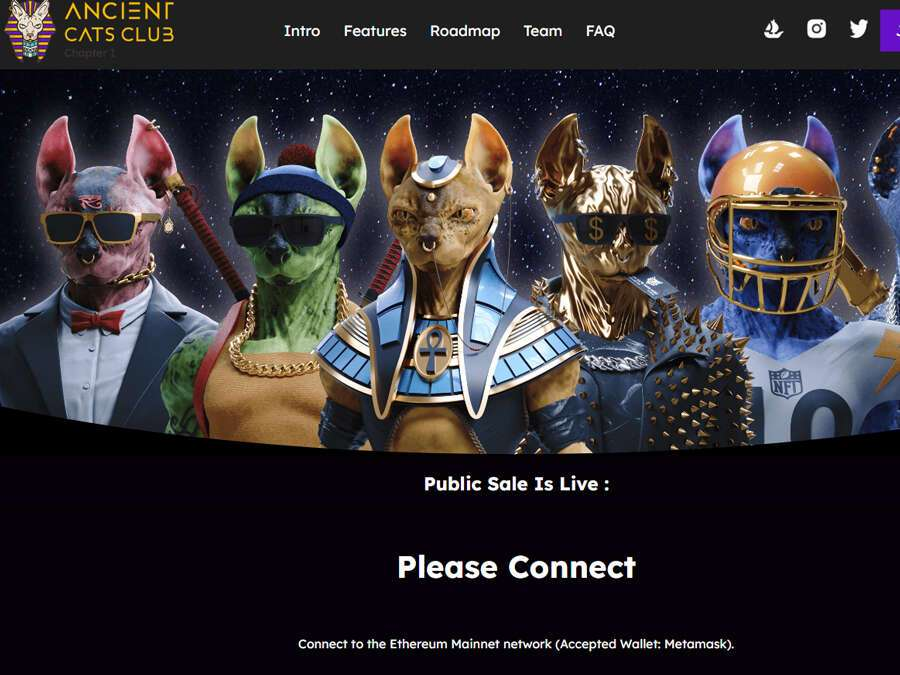

# Ancient Cats Club

Ancient Cats Club 是 2800 个 Ancient Cats NFT 的私人收藏——独特的数字收藏品。Ancient Cats 作为 ERC-721 代币存储在以太坊区块链上并托管在 IPFS 上。

拥有超过 180+ 种优质 3D 属性，每款 NFT 都是独一无二的，并附带古老猫俱乐部的独家访问权，一群成功的投资者将接管世界并建立一个新的帝国。加入一个雄心勃勃、不断发展的社区，拥有多种福利和实用程序。

古埃及沦陷数千年后，一场神秘的宇宙事件激活了金字塔：一股强大的能量束出现，打开了通往猎户座行星的星际门户。

外星人从传送门中出来，正是万众期待的古猫俱乐部的复兴。曾经被尊为神明的人形斯芬克斯猫已经回归统治并建立了一个新的时代帝国。

问题变成了：现代世界会再次崇拜古猫俱乐部吗？Ancient Cats Club 已经存在了数千年，并且会像以前一样在地球上建立一个新时代的帝国。新时代帝国阶段已在我们的 Discord 频道上宣布。看看那里！与往常一样，古猫猫的忠实信徒将获得奖励。准备好！

