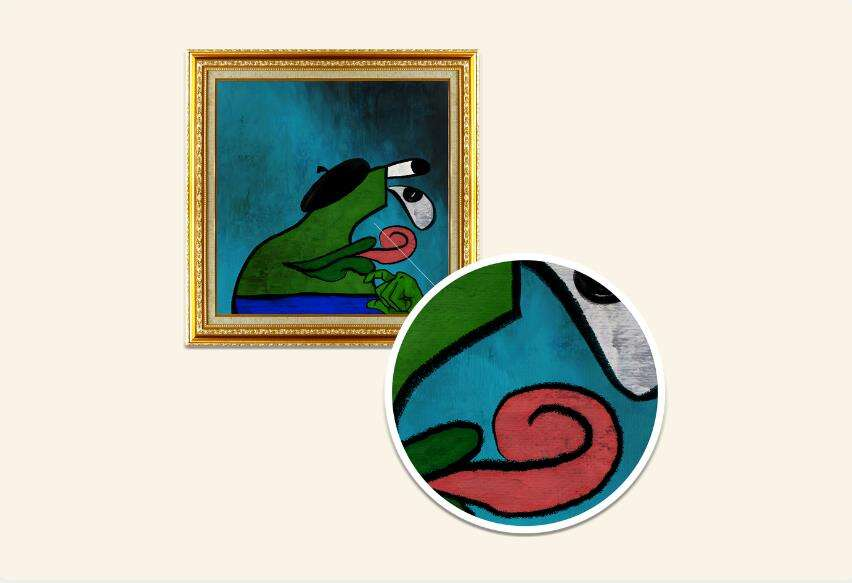

# Andy Borphol

以前被认为是由 MOMB 丢失的收藏，专门免费赠送给 Borpacasso 的持有者（只需支付汽油费）。

MoMB 将流行的互联网文化与美术先例相结合，颠覆艺术经典，开发出一种全新且广受认可的 NFT 艺术形式。具体来说，Borpa 的抽象主义品质与 20 世纪不可或缺的现代艺术运动相结合，从立体主义开始，提高了互联网生成的模因形式的权威。MoMB 为公众提供了查看、学习和与这种新兴形式互动的独特机会。

## 生成艺术不应该意味着失去细节。

MoMB 发布的每一个 NFT 都是由我们的驻地艺术家精心制作的，包括笔触、涂抹等。

我们的 NFT 看起来与市场上的任何其他 NFT 不同，充满活力的细节、手绘风格，最重要的是 -让每个人都知道你很富有，而他们可能很穷所需的*je ne sais quoi 。*

此外，我们集合中的每个 NFT 都具有至少 18,000,000 种可能的特征组合。没有两个会看起来一样。

