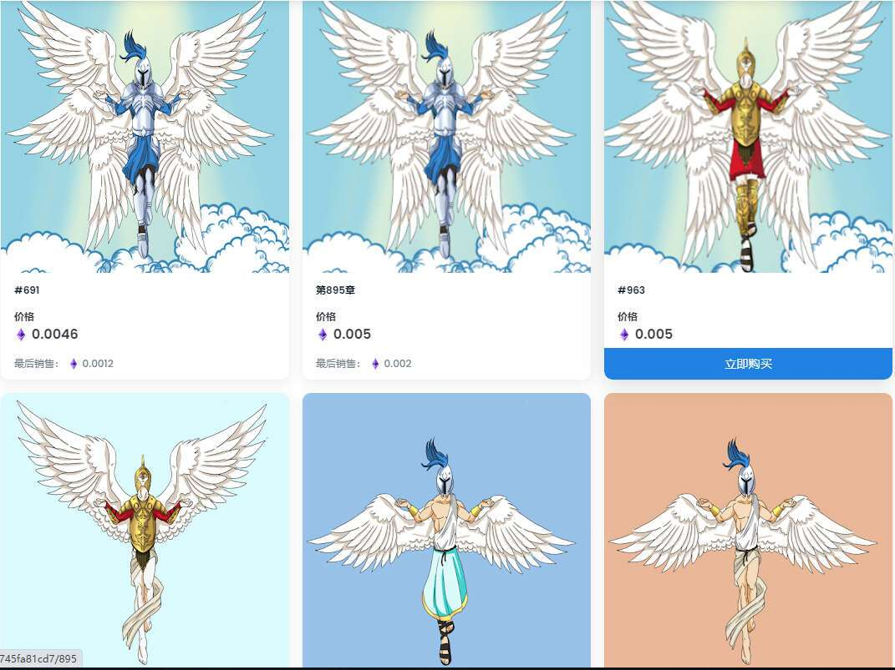

# Angel Of Giving

Angel of Giving 是一个 2000 Nfts 的收藏品，用于向持有者支付奖品。

以 100 个 nft 批次发售 - 90 个待售，5 个用于我们不和谐的比赛，其他 5 个是上一个区块中前 5 名购买者的奖品。

每 100 批的奖品售罄 - 将持有人地址输入抽奖 - 奖品 1 50 美元 奖品 2 售出 1000 份时 20 美元 所有持有者进入抽奖 - 奖品 1 美元 300 美元 奖品 2 美元 奖品 3 100 美元 奖品 4 和 5 2000 美元售出时 50 美元 所有参与抽奖的持有者 - 奖金 1 美元 300 美元 奖金 2 美元 200 美元 奖金 3 美元 100 美元 奖金 4 和 5 美元 50 美元

特许权使用费设定为 10%，在每个月末，所赚取的特许权使用费将被添加到每月抽奖中，4 个奖品平分 40/30/20/10% 的底池。

