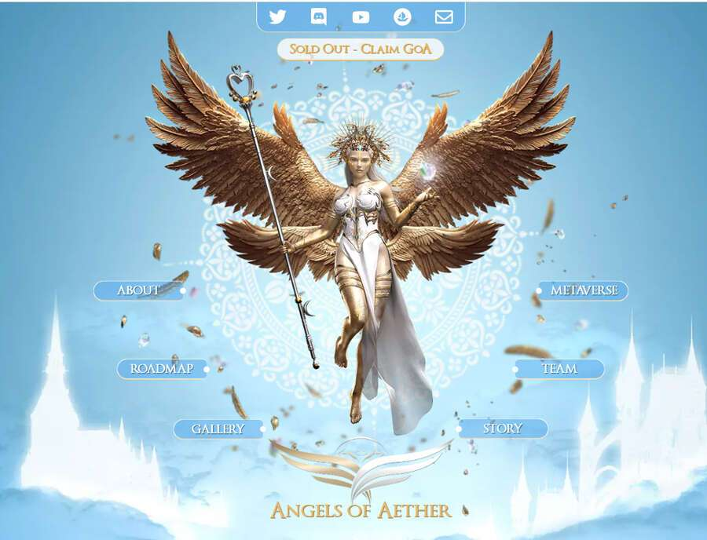

# Angels of Aether

Angels of Aether 是一款可在游戏中使用的 3D、全身、高分辨率（5000x5000 像素）收藏品，是您在以太坊和虚幻引擎上构建的沉浸式 5D Metaverse 的黄金门票，为持有者提供无限范围的实用程序。每个天使和守护者 NFT 都是全 3D 游戏内可玩 Avatar 的代表。

作为 AoA 持有者，您将获得大量实用程序，包括 Play-to-Earn 和 Player-vs-Player 游戏、市场、画廊和土地/住房的折扣、可索取的 NFT 和免费解锁、优先白名单访问独家版本，数字房地产和土地交易/租赁/建筑，参加特别活动，展览等等！

AoA 持有者将收到一份可索取的礼物，用于持有他们的天使和守护者对，以美丽、华丽和高级**3D NFT 画廊**的形式，您可以在其中存放您的 NFT，可展示 100 个 NFT。要访问您的画廊，您可以通过 Metamask 连接您的钱包，然后您将被传送到您的虚幻引擎级别画廊，在那里您可以放置和展示您的 NFT 并举办活动/展览——图形和美学将具有电影级别，由我们高度创建才华横溢的艺术家和游戏开发者。

我们已经开始在虚幻引擎上构建我们的 Metaverse - **Aether-Verse** - 完全沉浸式的 5D Metaverse，在以太坊区块链上运行。我们正在与一家游戏工作室以及独立、专业的游戏开发人员/架构师/艺术家合作，他们之前曾在 Epic Games、暴雪、微软、星球大战、权力的游戏、战锤等备受赞誉的公司和项目中工作过，拥有数十年的游戏开发经验。有关团队的更多详细信息即将推出。

在**Aether-Verse**中，AoA NFT 的持有者将拥有一流的访问权限：

- 数字房地产和土地财产
- Play-To-Earn 和 Player-To-Player 游戏
- 画廊
- 游戏内资产，例如自定义特征和配饰
- 流动性挖矿
- 可定制的字符
- 神秘生物
- 游戏内可玩的同伴
- 派对和音乐会
- 展览
- 交易与收藏
- 土地和物业租赁
- 未来收藏品和画廊的早期白名单地点
- ...以及更多！

准备好在您的座位边缘跟随以太天使的故事！在接下来的几个月里，您将看到几条情节线在一个更大的故事弧下展开，您可以帮助塑造作为以太天使 Metaverse-Realm 的参与者。我们希望我们生态系统的每一个方面都与 Aether-Verse 的故事有着内在的联系。我们还将以视觉形式将其变为现实，并为您带来一本图画小说/漫画书，它将展示以太诗歌的惊人故事，从天使和以太守护者开始。

##  艺术家支持

从第一天开始，我们就想以各种富有成效的方式回馈 NFT 艺术家社区。

我们已经开始支持艺术家，开设新的合作并支持空间，通过从艺术家那里购买 NFT，雇佣艺术家来构建和创建 Aether-Verse，并选择艺术家来帮助管理我们的社区。

我们将成立“AoA 艺术基金”，用于投资 NFT 艺术家，举办艺术比赛，与艺术家合作，为艺术家提供一个平台，让他们能够创建和组织展览和画廊，创造游戏内资产，将在元界中使用，以及各种

**Aether-Verse**是基于**以太坊**和**虚幻引擎 5**构建的完全沉浸式 5D 元宇宙，由 NFT 和**Play-to-Earn**系统提供支持。Aether-Verse 去中心化经济基于已建立的社区 DAO，为创作者带来无限可能，可以在游戏中使用、在 Aether-Verse NFT 市场和元界内买卖的创作。
