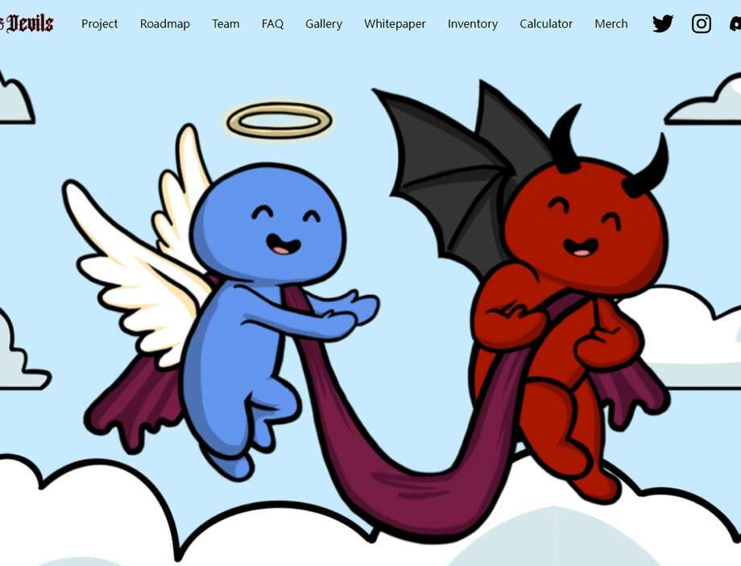

# AngelsDevilsNFT

Angels and Devils 是 10,000 个手绘 NFT 的集合！该系列由 5,000 名天使和 5,000 名恶魔组成，他们同意抛开分歧，作为朋友一起进入元宇宙！这不仅仅是另一个 PFP 系列。我们的游戏开发人员已经开始为我们的 Metaverse：Celestial World 制定和制定计划，这是一个基于故事的 MMO，灵感来自我们的漫画书：Celestial Tales。薄荷一结束，我们就开始在我们的第二个元节中工作。

 **欢迎来到天城！ **

千方百计，地狱终于冰封了。恶魔们不知去向，于是传说恶魔们向传说天使们求救。如今，天涯相隔千山万水，天魔终于放下分歧，在天城和平共处。请继续关注我们的漫画书系列发布，以了解有关故事的更多信息！

我们团队建立的 NFT 世界将被称为天城！它将充满P2E小游戏、PVP区域、社区活动、持有者的VIP区域、艺术画廊、合作项目的特殊区域等等。请继续关注您未来家的公告！

我们项目的启动日期是 2 月 25 日（白名单）和 2 月 26 日（公开发售）。

你需要有一个带有以太坊资金的 web3 钱包（即 Metamask）。您将您的钱包连接到我们的官方网站，并在发布之日铸造 NFT 代币。

您也可以使用 $WRLD 代币进行铸造！

白名单的价格为 0.04 ETH 和 400 $WRLD。

公开发售的价格为 0.05 ETH 和 450 $WRLD。

至于gas，我们将通过我们独特的智能合约使其尽可能低。

（Gas 是指在以太坊区块链平台上成功进行交易或执行合约所需的费用或定价价值）

我们喜欢称之为 Celestial Map 的 Roadmap 1.0 可以通过我们的网站或 Discord 的 🔭┃celestial-map 频道查看。

我们的核心团队受雇于 Celestial Studios 公司。在 Celestial Studios，我们专注于元宇宙及其所有利基市场：游戏、零售、音乐、商务会议等。我们的目标是让广大公众更容易接触元宇宙，从天使与魔鬼的推出开始！

我们的专业团队由社区经理、营销人员、两位艺术家、设计师、版主、业务发展专家等等组成！@D12 - @Celstudios 是我们的创始人，名叫 Eduardo，他完全被人盯上了。

