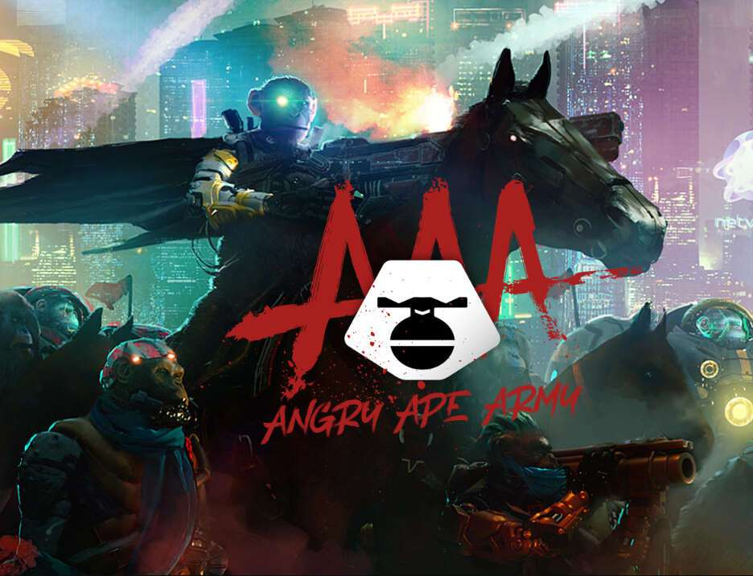

# Angry Ape Army

在一个由人类过度、贪婪和对权力的渴望所主宰的世界里，而保护被置之不理，猿类多年来一直在接受这一切。以他们至高无上的智慧，他们大多坐下来观察。然而，当世界处于如此灾难性的阶段，无法回头时，猿猴就履行了世界保护者的职责，挺身而出。

3,333 只原始猿类的集合。所有 OG Ape 持有者都被授予完整的元宇宙实用程序和访问“猴子岛”的机会，并有机会玩耍、赚取和挖掘奖励。所有 OG Ape 持有者也将获得免费薄荷糖，用于即将到来的掉落。此外，持有 OG Ape 可让您 VIP 访问独家活动、商品、白名单机会等。

臭名昭著的“猴子岛”上的神秘电涌导致通往不同进化猿世界的门户，连接不同维度和平行宇宙。门户聚合的战场站点，变异猿在无拘无束的大逃杀中对抗来自未来的猿的技术进步。这个世界的猿类现在意识到，我们并不孤单……战争才刚刚开始。

来自病毒或纳米血统的 10,000 只进化猿的集合，具有完整的虚拟宇宙实用性。燃烧和升级 EVO 以收集 Valkyries、Golems、Goliaths、运输工具、武器等等。

一个未知开始的古老预言……如果生命的自然秩序陷入不可逆转的混乱之中，传说一个神秘的品种会出现，带来纠正和平衡。一群凶猛的瓦尔基里战士将从远处召唤出来，以无畏的勇敢和坚定不移的道德而闻名。

4,444 名 Valkyrie 战士的集合，准备好迎接元宇宙之战。Angry Ape Army Universe 中不可或缺的重要收藏部分。

打造一个垂直整合的品牌，融合实体商品、混合媒体资产、NFT 收藏品以及身临其境的电影虚拟世界体验。
