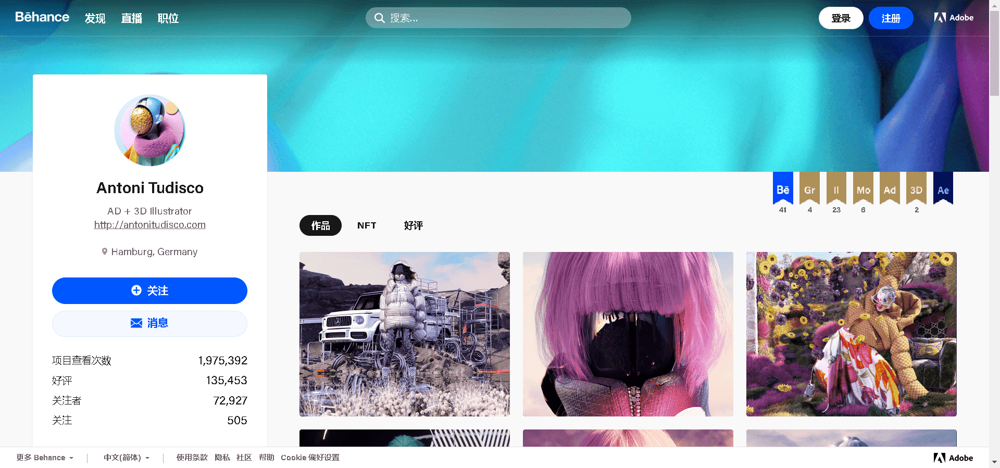

# Antoni Tudisco

创意总监和 3D 视觉艺术家 Antoni Tudisco 在德国汉堡出生和长大，在那里他从小学习媒体管理和网页设计与开发编程。与耐克、阿迪达斯、范思哲、谷歌、梅赛德斯奔驰、D&G等顶级品牌合作，并推出了自己的品牌TUDISCO STUDIO。曾在 Vogue、Highsnobiety 和 Hypebeast 上亮相，并赢得了多个著名的设计奖项。

▶ 什么是 Antoni Tudisco？
Antoni Tudisco 是一个 NFT（不可替代令牌）集合。存储在区块链上的数字艺术品集合。

▶ 有多少 Antoni Tudisco 代币？
总共有 1,114 个 Antoni Tudisco NFT。目前，195 位车主的钱包中至少有一个 Antoni Tudisco NTF。

▶ 最昂贵的 Antoni Tudisco 拍卖会是什么？
售出的最昂贵的 Antoni Tudisco NFT 是 ETHEE #433/608。它于 2022-08-23（9 天前）以 197 美元的价格售出。

