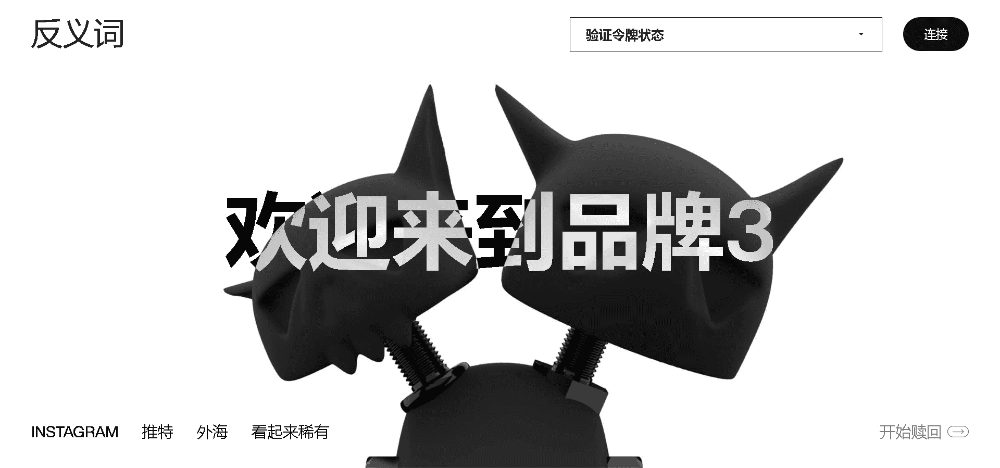

# Antonym: GENESIS

Antonym 是一个 phygital 生活方式品牌，弥合了数字收藏品和实体设计师商品之间的差距。反义词：Genesis 是 8,888 个 NFT 的 Phygital 集合。每个持有人都有资格兑换限量版设计师艺术玩具。

▶ 什么是反义词：GENESIS？
反义词：GENESIS 是一个 NFT（Non-fungible token）集合。存储在区块链上的数字艺术品集合。

▶ 存在多少反义词：GENESIS 代币？
总共有 8,888 个反义词：GENESIS NFT。目前，4,181 位所有者的钱包中至少有一个反义词：GENESIS NTF。

▶ 最昂贵的反义词：GENESIS 销售是什么？
最昂贵的反义词：GENESIS NFT 售出的是 . 它于 2022 年 6 月 22 日（2 个月前）以 3.3 万美元的价格售出。

