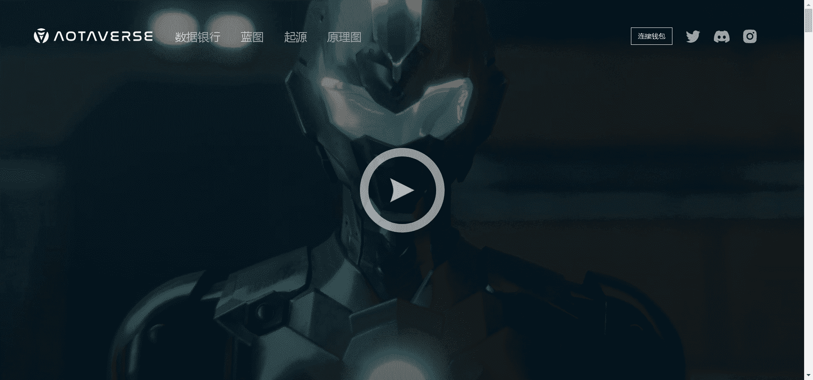

# Aotaverse Original

AOTA的移动单元终于到了。完全 3D 和生成模型，在 AOTAVERSE 与我们见面。

由东方实验室。

Aotaverse 是我们在以太坊上的创世 NFT 集合，由 4 个主要部落组成：Kaanon、Rogene、Akune 和 Tamee。

▶ 什么是 Aotaverse Original？
Aotaverse Original 是一个 NFT（不可替代代币）集合。存储在区块链上的数字艺术品集合。

▶ 存在多少个 Aotaverse Original 代币？
总共有 599 个 Aotaverse Original NFT。目前，341 位所有者的钱包中至少有一个 Aotaverse Original NTF。

▶ 最昂贵的 Aotaverse Original 销售是什么？
最贵的 Aotaverse Original NFT 是 Aota 226。它于 2022-06-15（3 个月前）以 110.4 美元的价格售出。

