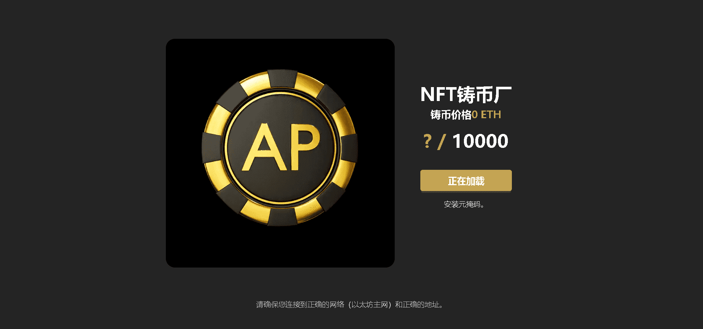

# AP Club NFT

AP俱乐部是世界上第一个Advantage Player社区。在这个社区中，每个成员都可以通过 Web 3.0 中的 NFT 功能获得合理的报酬。我们希望会员可以相互分享并开发更多方法来尽早实现他们的财务自由目标。怀着这样的愿景，我们希望各种AP能够自动聚集到这个站点并加入我们。

▶ 什么是 AP 俱乐部 NFT？
AP Club NFT 是一个 NFT（Non-fungible token）集合。存储在区块链上的数字艺术品集合。

▶ 存在多少 AP Club NFT 代币？
总共有 159 个 AP Club NFT NFT。目前 129 位所有者的钱包中至少有一个 AP Club NFT NTF。

