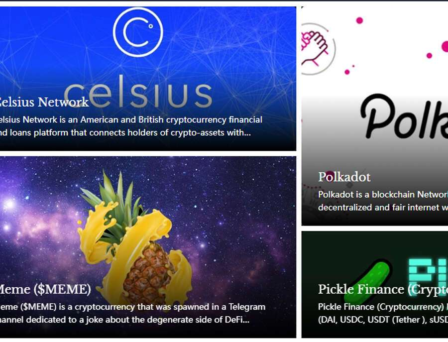

# AP Presidential 2020

将区块链知识带入世界，将知识带入区块链。Everipedia 使用区块链技术来帮助我们实现我们对一个所有人都可以使用所有知识的世界的愿景——一个每个人、任何地方都可以参与分享他们所知道的知识并为他人提供价值的世界。

美联社称 2020 年总统大选是关于区块链的——来自外太空的观点是美联社的第一部 NFT 艺术品。除了总统选举之外，美联社和 Everipedia 还合作召集了几项备受瞩目的链上活动，包括 2021 年参议院决选选举和超级碗。我们还安排了许多未来的 Everipedia OraQle 合作。美联社将 2020 年总统选举称为区块链——来自外太空的观点是美联社为历史事件创建的一系列一次性 NFT 中的第一篇。

我们建立世界上最伟大的百科全书的使命需要一支能够迎接巨大挑战的熟练执行团队。在 Everipedia，我们很幸运拥有在教育和区块链行业拥有丰富经验和知识的人。

