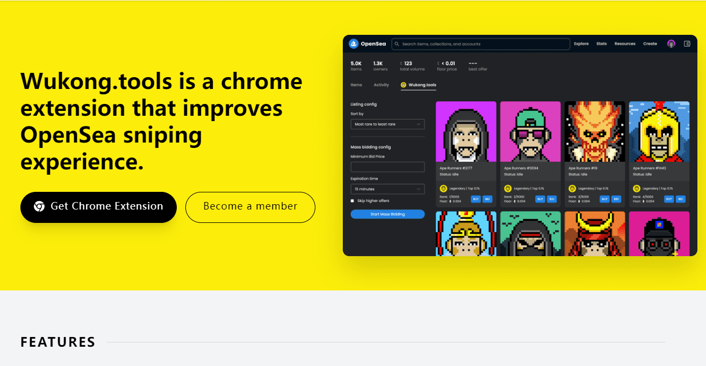

# Ape Runners

Wukong.tools 是一个改进 OpenSea 狙击体验的 chrome 扩展。轻松查看每个 NFT 项目的底价。不再需要向上滚动。查看每个 NFT 物品的稀有度。无需再访问 rarity.tools。在您的 chrome 选项卡中查看当前流行的集合。无需通过 OpenSea 弹出窗口即可快速购买和出价您想要的 NFT。在同一页面中快速批量出价您想要的 NFT。即将推出的功能包括价格提醒、收藏概览等。

Balapa 是 Wukong.tools 的创始人。他负责 Wukong.tools 的开发和设计。Samet 是一名全栈开发人员，目前正在构建 Wukong.tools。
