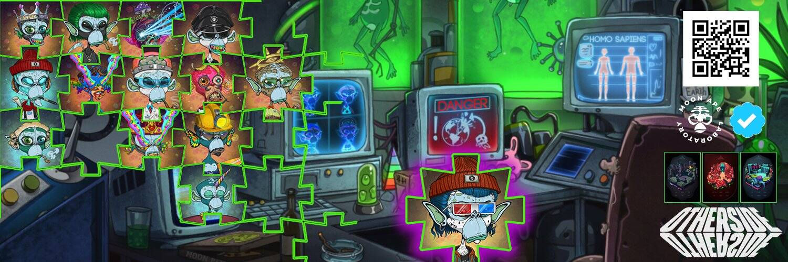

# Moon Ape Treasury V2

Moon Ape Laboratory 汇集了 8,000 只设计精良的类人猿，它们具有不同的特征，为每个人都增添了一些东西。围绕着一个由忠实的加密爱好者组成的自我维持社区而建立，我们的主要目标是为我们的成员提供 NFT 领域中一些最独特、最详细的艺术作品。您的 Moon Ape NFT 在质押时每天都会累积一个实用程序“$MAL”代币。$MAL 代币旨在仅在 Moon Ape Laboratory 生态系统中发挥作用，它们可用于从我们的其他 Moon Ape Lab 收藏中购买 NFT。实验室开发人员不提供也不打算提供 $MAL 代币的二级市场。

