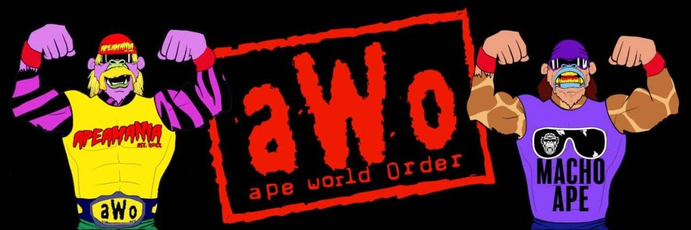

# Ape World Order

猿世界秩序
AWO，5000 个职业摔跤猿，由 1000 个资产组合而成。
每个 AWO NFT 有 8 个属性，按 0-100 等级评分。
即将推出多边形，薄荷 AWO 与$PIZZA

- 为 AWO 设计原创艺术，包括我们的 3 个传奇系列 1 猿：Macho Ape、Hulk Ape 和 Ultimate Ape。

- 部署 AWO 铸造 DAPP，5,000 个独特的 NFT，由 1,000 多种资产组成，由 8 个属性组成。

-开始为 AWO NFT 开发我们的视频游戏。

-$PIZZA 是 AWO 用于所有游戏内购买的官方货币（一旦推出），也是铸造 AWO 接受的货币之一。

- 每个 AWO NFT 有 8 个属性，评分为 100。这些将是确定您的 NFT 是窗帘夹克工作人员还是注定要成为主赛事的关键因素！

- 开始 AWO 系列 2 的美术开发。

  
