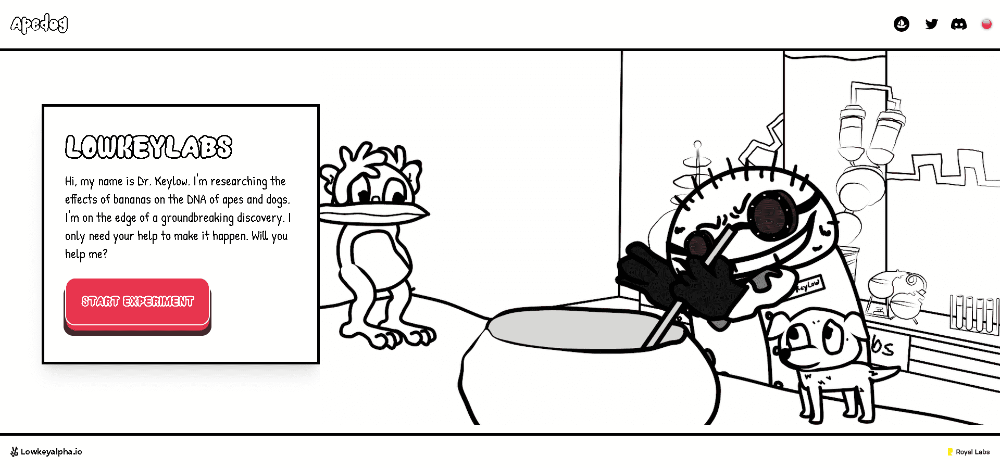

# apedog.wtf

嗨，我的名字是 Keylow 博士。我正在研究香蕉对猿和狗 DNA 的影响。我正处于一个突破性发现的边缘。我只需要你的帮助来实现它。你会帮我吗？

▶ 什么是apedog.wtf'？
apedog.wtf' 是一个 NFT (Non-fungible token) 集合。存储在区块链上的数字艺术品集合。

▶ 有多少个apedog.wtf' 代币？
总共有 14 个 apedog.wtf' NFT。目前有 2 位所有者的钱包中至少有一个 apedog.wtf' NTF。

▶ 最昂贵的apedog.wtf' 销售是什么？
出售的最昂贵的 apedog.wtf' NFT 是 apedog.wtf。它于 2022 年 6 月 25 日（2 个月前）以 22 美元的价格售出。

▶ 最近卖出了多少个apedog.wtf'？
过去 30 天内售出 1 个 apedog.wtf' NFT。

