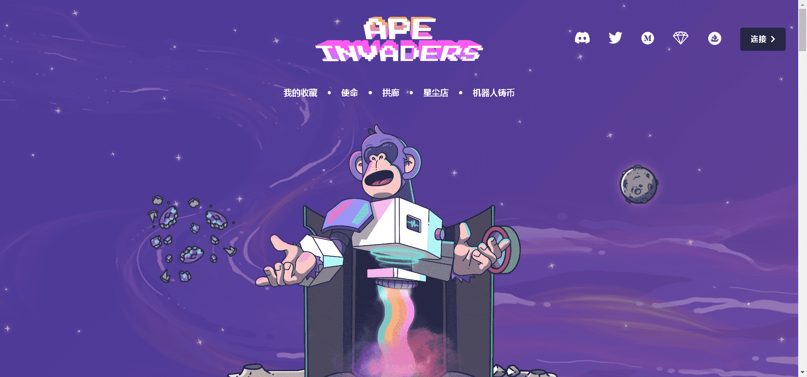

# Ape Invaders Official

5,500 只创世猿执行入侵元宇宙中每个星球的任务。所有 Ape Invaders 将因参与 Planet Invasions 而收集 $Stardust。

西米亚之战被称为永远改变猿类文明轨迹的那一天。就像其他人一样，猿人开始了他们通常的资源开采活动。突然天空变厚了，出现了大量的星舰。没有一只猿能分辨出这些入侵者是谁以及他们属于哪个文明。

当时他们完全不知道这些星际飞船的技术进步和整体实力——只有关于这些入侵者以及他们造成的死亡和破坏的恐怖故事。直到他们出现在西米亚之前，描述他们的故事都只是代代相传的民间传说......

