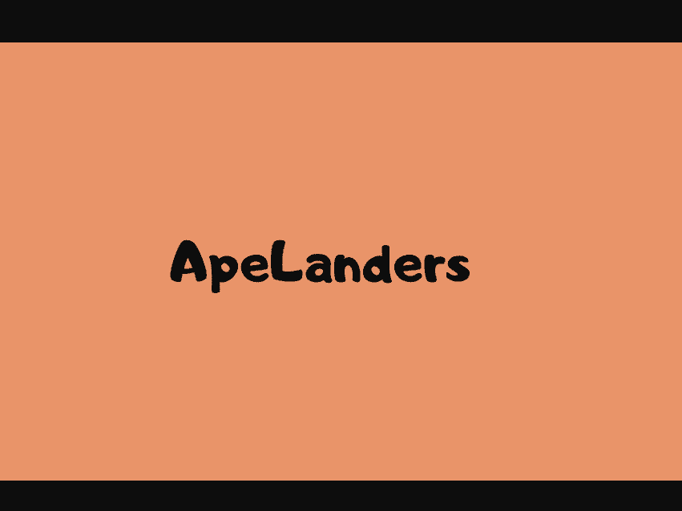

# ApeLanders NFT

2,222 名 ApeLanders 在主网上关押了囚犯。

没有路线图，没有官方不和谐，只有艺术！

▶ 什么是 ApeLanders NFT？
ApeLanders NFT 是一个 NFT（Non-fungible token）集合。存储在区块链上的数字艺术品集合。

▶ ApeLanders NFT 代币有多少？
总共有 2,222 个 ApeLanders NFT NFT。目前，459 位所有者的钱包中至少有一个 ApeLanders NFT NTF。

▶ 最昂贵的 ApeLanders NFT 销售是什么？
出售的最昂贵的 ApeLanders NFT NFT 是 ApeLander #132。它于 2022-06-18（3 个月前）以 1.1 美元的价格出售。

