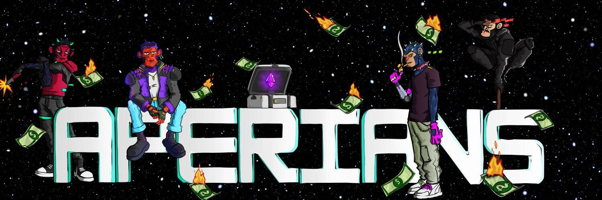

# AperiansClub

Aperians Club 是大型 Web3 生态系统的一部分。一个社区项目，致力于为 web3 空间中的投资者、艺术家和创作者提供更安全的环境。

▶ 什么是 AperiansClub？
AperiansClub 是一个 NFT（非同质代币）集合。存储在区块链上的数字艺术品集合。
▶ 有多少 AperiansClub 代币？
总共有 3,086 个 AperiansClub NFT。目前，2,025 位车主的钱包中至少有一个 AperiansClub NTF。
▶ 最昂贵的 AperiansClub 销售是什么？
售出的最昂贵的 AperiansClub NFT 是 Aperians Club (Not Revealed)。它于 2022 年 6 月 11 日（2 个月前）以 16 美元的价格售出。
▶ 最近卖出了多少 AperiansClub？
过去 30 天内售出了 29 个 AperiansClub NFT。
▶ AperiansClub 的费用是多少？
在过去 30 天里，最便宜的 AperiansClub NFT 销售额低于 4 美元，最高销售额超过 14 美元。在过去 30 天内，AperiansClub NFT 的中位价格为 7 美元。

