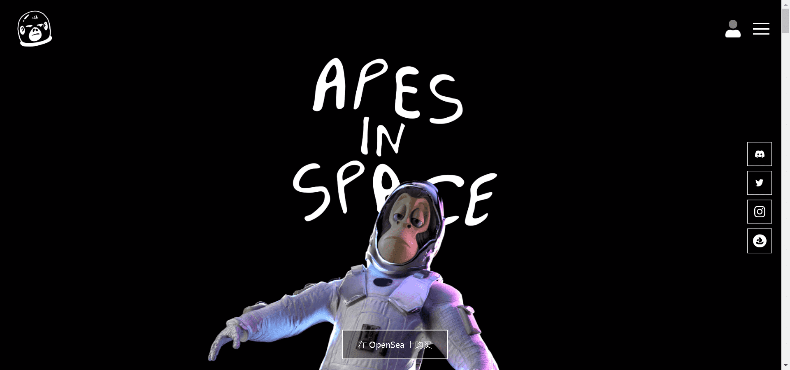

# Apes In Space NFT

太空猿之家NFT项目由Takeoff发起，1/3的获奖团体Migos。

Apes in Space 持有者将能够质押他们的 NFT，以换取该项目独有的原生代币**$TKOFF** ，该代币将用于许多未来的公用事业。这些实用程序只能通过使用本机令牌来访问。

Apes in Space 项目将创建要集成到元宇宙中的化身和物品。我们的目标是成为 Metaverse 中的顶级 IP，我们计划在接下来的几个月内在这个领域进行多次集成。

