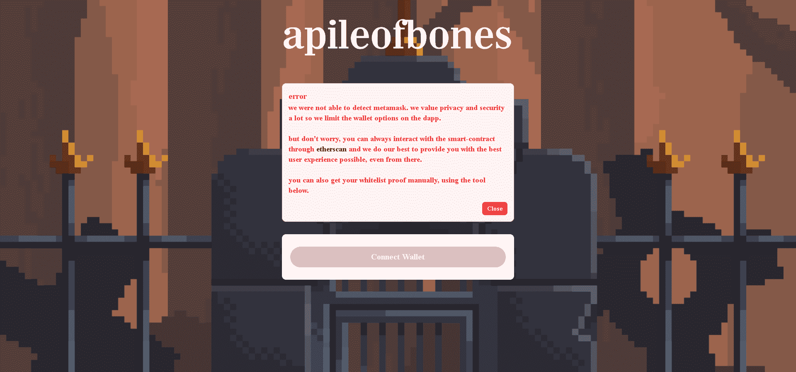

# apileofbones

▶ 什么是骨尖？
apileofbones 是一个 NFT（非同质代币）集合。存储在区块链上的数字艺术品集合。

▶ 有多少 apileofbones 代币？
总共有 2,404 个 apileofbones NFT。目前，1,008 位车主的钱包中至少有一个 apileofbones NTF。

▶ 最昂贵的 apieofbones 销售是什么？
最昂贵的 apileofbones NFT 是 apileofbones。它于 2022 年 6 月 29 日（2 个月前）以 658.7 美元的价格售出。

▶ 最近卖出了多少根顶骨？
过去 30 天内售出了 4,798 个 apileofbones NFT。

