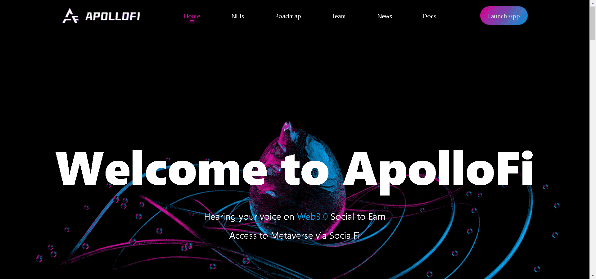

# ApolloFi

ApolloFi 是一个基于多链的集成社交网络平台，用于 Web3.0 时代的创意、NFT。通过赋予创造者权力，让更多的人为整个生态做出贡献。ApolloFi 旨在为所有创作者建立一个自由多样的天堂。

ApolloFi 将 web3 社交网络从想法变为现实。在这个全新的社交元界中，你可以建立自己的社交王国和无形的 NFT 资产。让我们看看 ApolloFi 给我们带来了什么！

ApolloFi 是一群坚定的加密货币信徒，他们的职业是 Web3 和 NFT。我们是一支 16 人的团队，来自北美
、欧洲、东南亚等地区。

