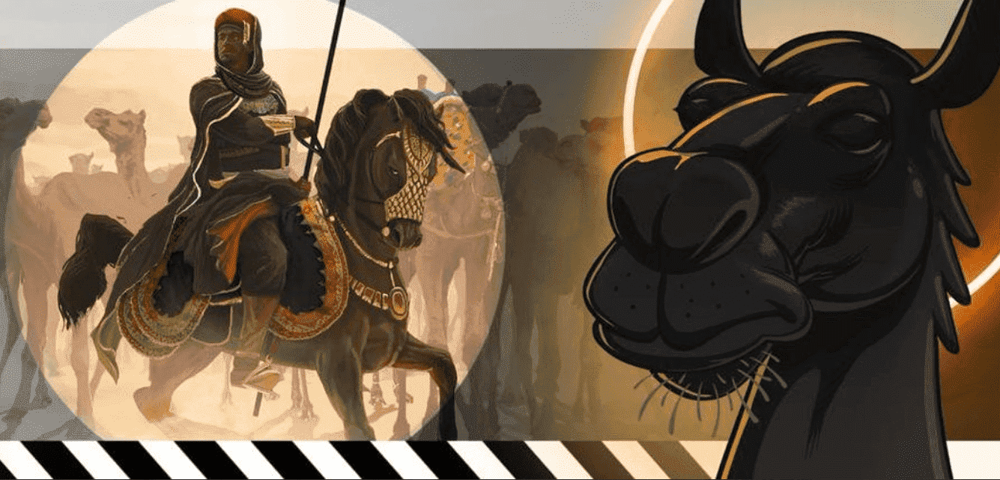

# Arabian Camels

Antara Universe NFT 系列是受古代阿拉伯战士启发的 NFT 的集合，使爱好者能够成为大事的一部分。

阿拉伯骆驼 NFT 是该系列中的第一个发布。阿拉伯骆驼是生活在以太坊区块链上的 12,012 个独特生成的数字收藏品的集合。

每只骆驼都是由超过 180 种资产以编程方式生成的，这些资产具有 7 种特征，例如表情、配饰和头饰等。

随着我们项目的成熟，我们心爱的社区将解锁一些未来的福利和激励措施。“版权属于所有者。”

