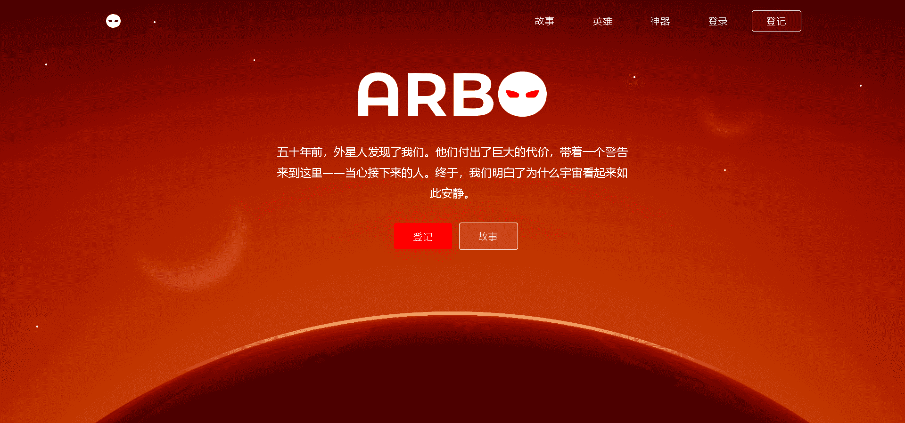

# ARBO Artifacts

ARBO 是一款科幻系列和回合制战术 (TBT) 策略游戏。查看官方ARBO 英雄合集以完成您的可玩策略。

▶ 什么是 ARBO Artifacts？
ARBO Artifacts 是一个 NFT（Non-fungible token）集合。存储在区块链上的数字艺术品集合。

▶ ARBO Artifacts 代币有多少？
总共有 50 个 ARBO Artifacts NFT。目前，1,911 位所有者的钱包中至少有一个 ARBO Artifacts NTF。

▶ 最昂贵的 ARBO Artifacts 销售是什么？
最昂贵的 ARBO Artifacts NFT 是 A Race Against Time。它于 2022 年 6 月 11 日（3 个月前）以 1.5 万美元的价格售出。

▶ 最近卖出了多少 ARBO Artifacts？
过去 30 天内售出了 31 个 ARBO Artifacts NFT。

