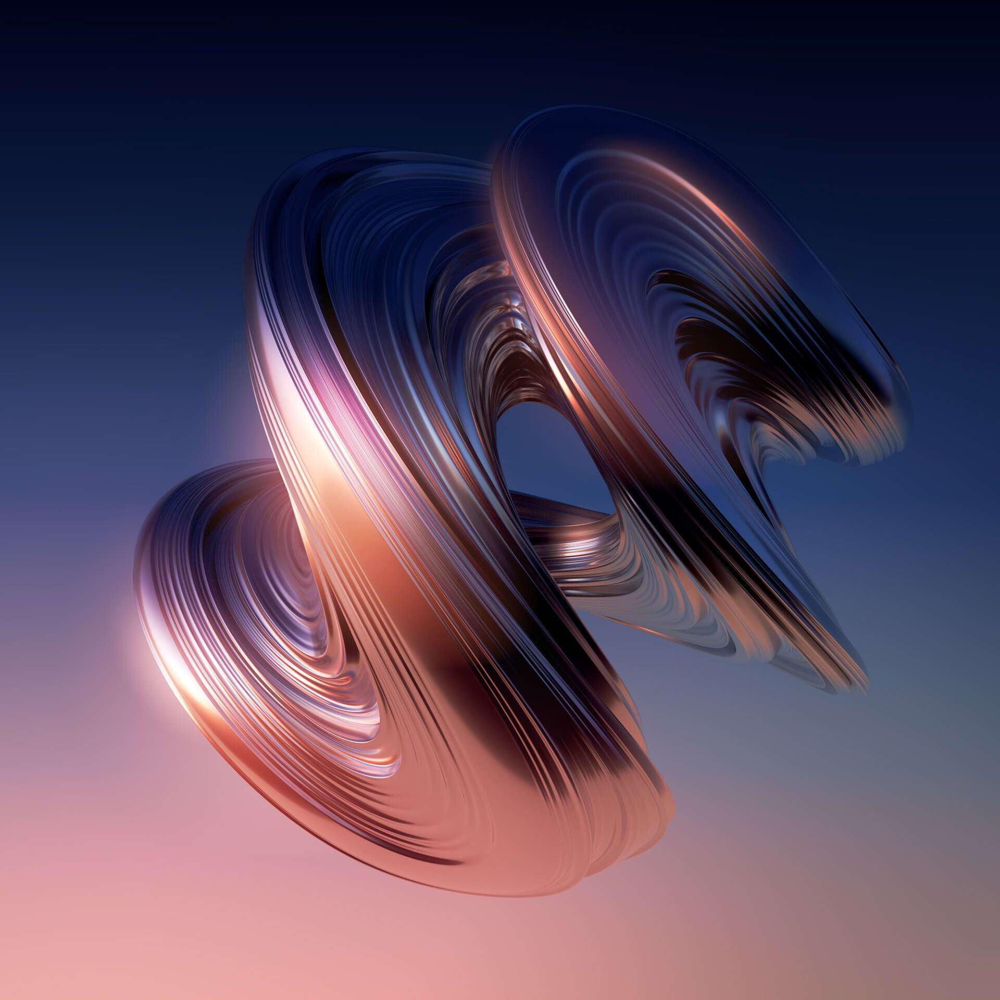

# Arcus by Rik Oostenbroek

Arcus 系列花了我大约 5 年的时间来创作。每个 Arcus 都是不同且独特的，并且是在我创作生涯的不同阶段制作的。这个系列是我作为自由创意者成功的开始，也激励了许多年轻艺术家开始追求创意事业。

五年前，是我职业生涯的一个巨大转折点。之所以？每次我想创作时，我总是从空白画布开始，所以我的作品非常直观。当我创建我的第一个 Arcus 时，情况并没有什么不同。因为它反映了我的个性和我当时所处的生活阶段，所以这个项目对我来说是一个巨大的转折点。 

从 13 岁开始，我一直在与严重的抑郁症作斗争，经历了一些极端的高潮和极端的低谷。我一直在与它作斗争，发现很难找到一些接受。在制作 Arcus 的过程中，不知何故，接受是缓慢而稳定的。我必须找到一种方法来处理它并无论如何都要发挥作用。2016 年左右，27 岁的我终于开始以自己的方式找到某种接受。我试图在精神上适应我多年来一直在对抗和憎恨的所有弱点。我没有与之抗争，而是开始将其投入到我的工作中。Arcus 反映了您在世界上找到自己独特的位置并接受您的独特特征的那一刻；作为一个人，他们可以多么糟糕。

