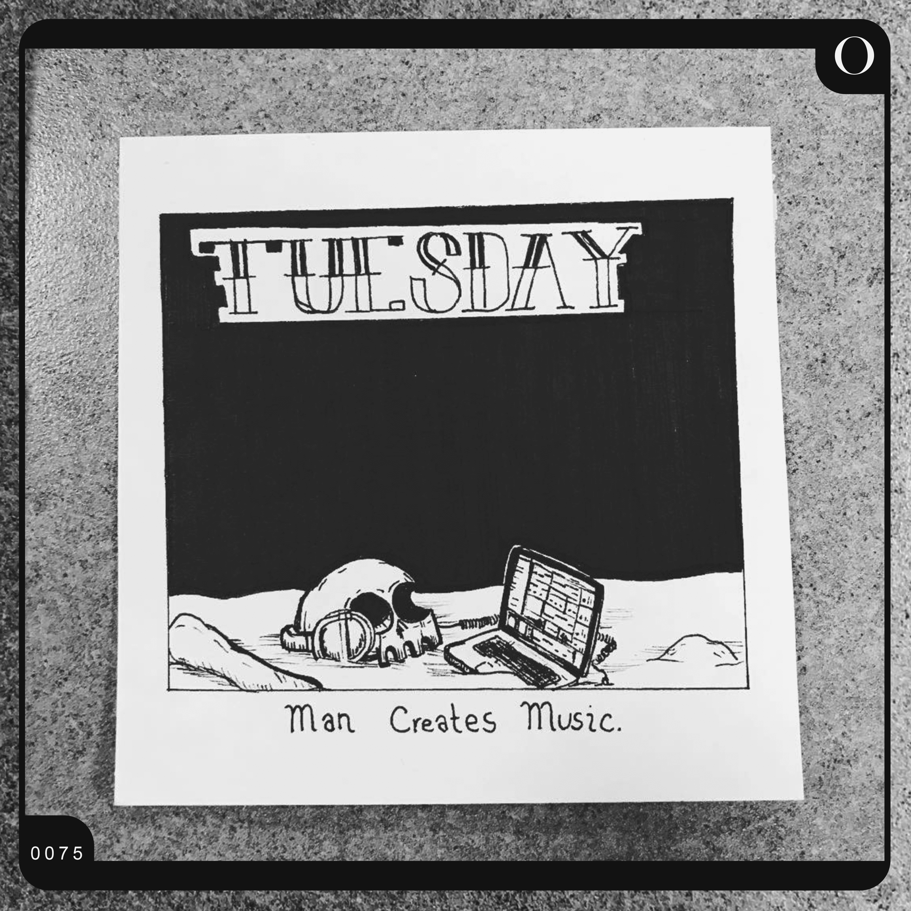

# Arq Skulls - Origins

Arq Skulls 的起源故事。

收集了 100 个手绘的便利贴、头骨，展示了多年来头骨角色经历的许多阶段和变化。该系列最初于 2017 年 2 月开始，随着时间的推移不断演变，最终成为 Arq Skulls NFT 系列。

每个人都有一个起源故事，这个属于Arq Skulls。

Arq Skulls Origins 是一个 NFT（不可替代令牌）集合。存储在区块链上的数字艺术品集合。

总共有 100 个 Arq Skulls Origins NFT。目前，57 位所有者的钱包中至少有一个 Arq Skulls Origins NTF。

