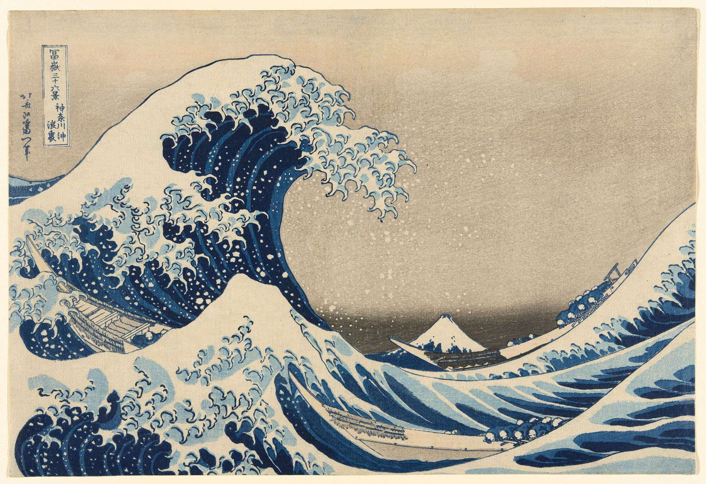

# ArtBannersByAI

基于知名艺术品的10000条横幅的AI艺术收藏。

▶ 什么是 ArtBannersByAI？
ArtBannersByAI 是一个 NFT（非同质代币）集合。存储在区块链上的数字艺术品集合。
▶ ArtBannersByAI 代币有多少？
总共有 10,000 个 ArtBannersByAI NFT。目前，3,648 位所有者的钱包中至少有一个 ArtBannersByAI NTF。
▶ 最昂贵的 ArtBannersByAI 销售是什么？
最昂贵的 ArtBannersByAI NFT 是 Art Banner #1085。它于 2022-06-30（2 个月前）以 548.9 美元的价格售出。
▶ 最近ArtBannersByAI卖出了多少？
过去 30 天内售出了 565 个 ArtBannersByAI NFT。
▶ ArtBannersByAI 的费用是多少？
在过去的 30 天里，最便宜的 ArtBannersByAI NFT 销售额低于 17 美元，最高销售额超过 104 美元。过去 30 天，ArtBannersByAI NFT 的中位价格为 33 美元。
▶ 什么是流行的 ArtBannersByAI 替代品？
许多拥有 ArtBannersByAI NFT 的用户还拥有 Rocket Riders NFT、 AINightbirds、 AImates和 BULLY ' APES。

