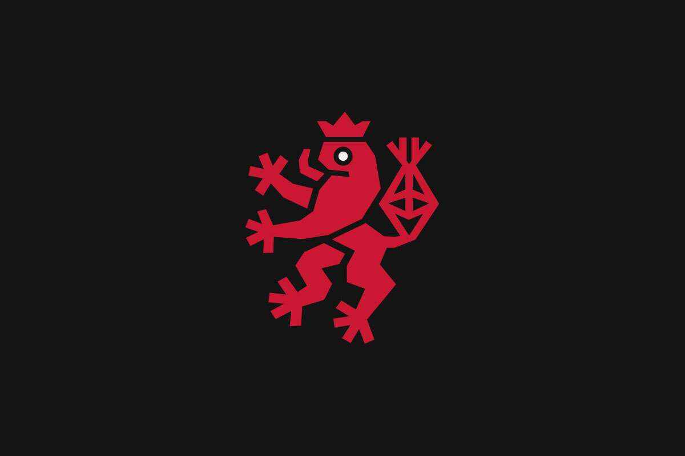

# ARTCODE Magazine

Redlion NEWS 由 Redlioneye 于 2020 年 8 月创立，现已发展成为一个重视加密教育、NFT 历史并渴望在保持乐趣的同时创造批判性思维的社区。

Redlion News 是第一家 NFT 印刷媒体出版商，并已成功推出 Redlion Gazette 作为我们的第一本 NFT 杂志，这是我们的旗舰产品。

通过 NFT 创新了一种独特的货币化机制，我们将新闻和历史保存作为一种服务带回给公众，而不是作为一种产品。

我们生态系统的新闻部分包括每日 NFT 新闻、关于我们的Discord 服务器的讨论、Twitter和Instagram的存在。

