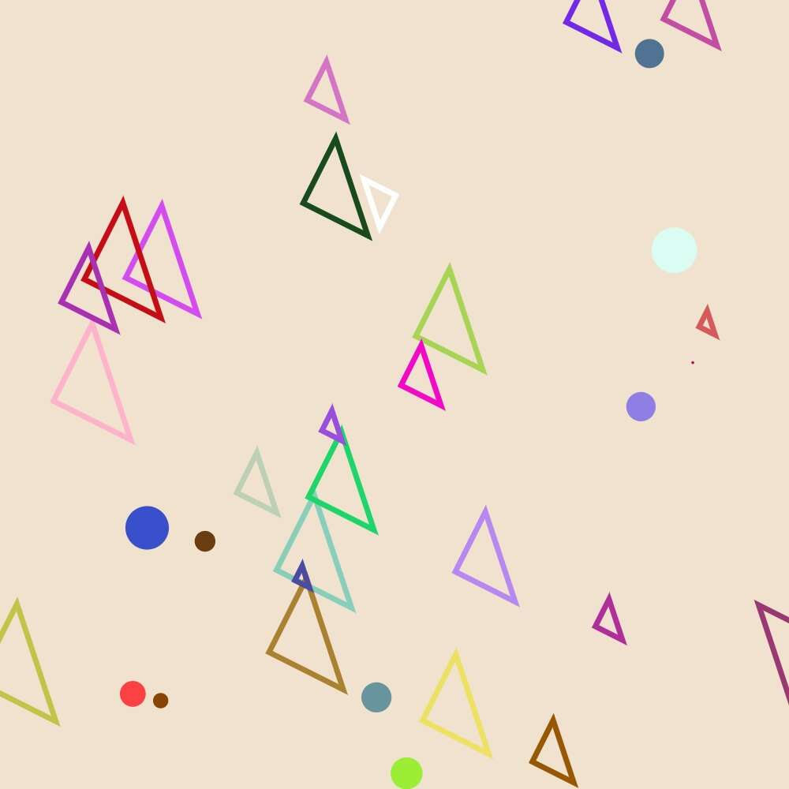

# ArtlessLabs Geometria

ArtlessLabs 几何学
艺术家 
Geometria 是 6,000 个独特的几何形状动画的集合，这些动画以确定性但随机生成的方式飞来飞去。每一个设计和动画都是完全独特的，不能重复。
每件艺术品都是随机生成的，并存储在以太坊区块链上。这幅画属于 p5js类型。

Sunflower Art 是一个去中心化的生成艺术平台。每件艺术品的代码、种子、描述和其他属性都存储在链上。每件艺术品都有自己的合同——主合同的代理——并且没有把关：任何人都可以在平台上创作作品。

