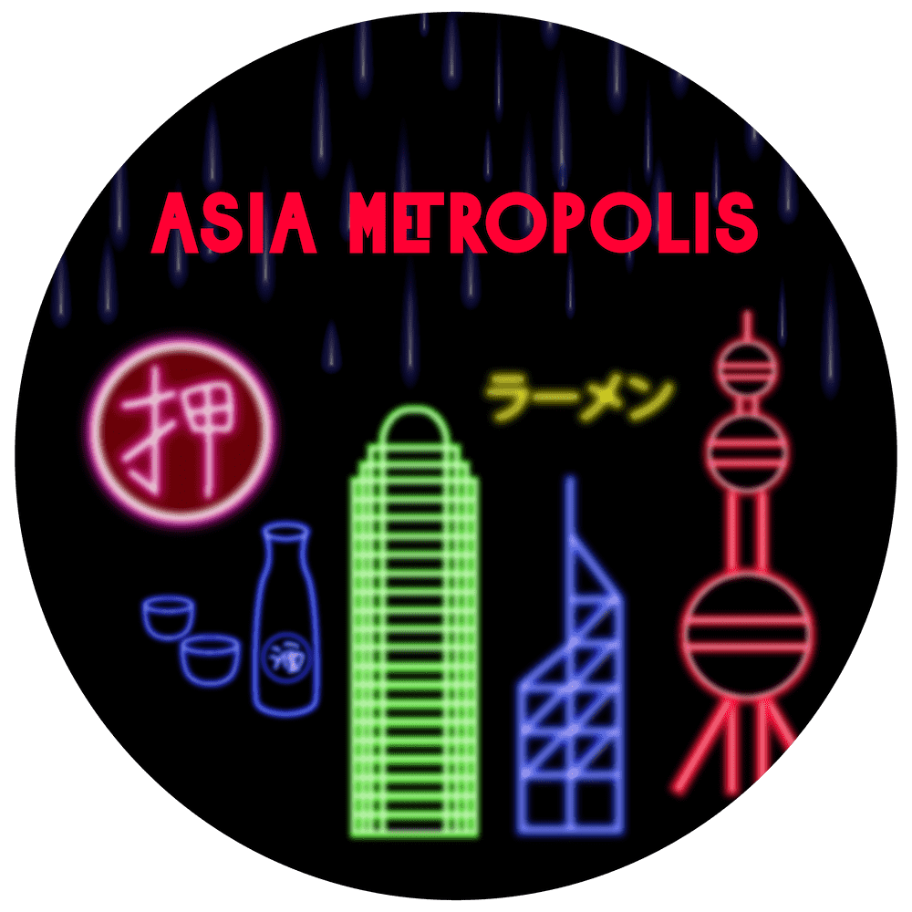

# Asia Metropolis

亚洲大都会是一个社区驱动的元宇宙。背包包含来自亚洲各地的随机生活方式装备和性格特征，生成并存储在链上。故意省略统计信息、图像和其他功能，以供社区解释和构建。

Asia Metropolis 是一个以现代亚洲为中心的社区驱动的元宇宙。

我们最初的薄荷是 8888 链上背包。背包包含随机生成的基本装备和性格特征。

颜色稀有度（最少到最稀有）：  白色的  绿色的

黄色  蓝绿色  粉色的

