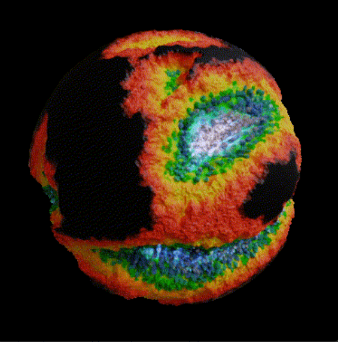

# ASM Gen II Brains

ASM Gen II Brains 🧠，第二代 Non-Fungible Intelligence™。通过基因组挖掘在 AIFA Moon 上注入原始矿物质。大脑能够学习和进化。它们可以跨不同的形式和世界进行互操作……由 AI 提供支持，归您所有，并作为 NFT 进行交易。

ASM 是一个平台和协议，用于在任何游戏世界、竞技场或宇宙中实现智能 AI 代理的自有能力、交易能力、可组合性和互操作性。

完全基于自主代理创建游戏。或者通过智能道具和游戏内助手为玩家控制的游戏添加新的经济层。

