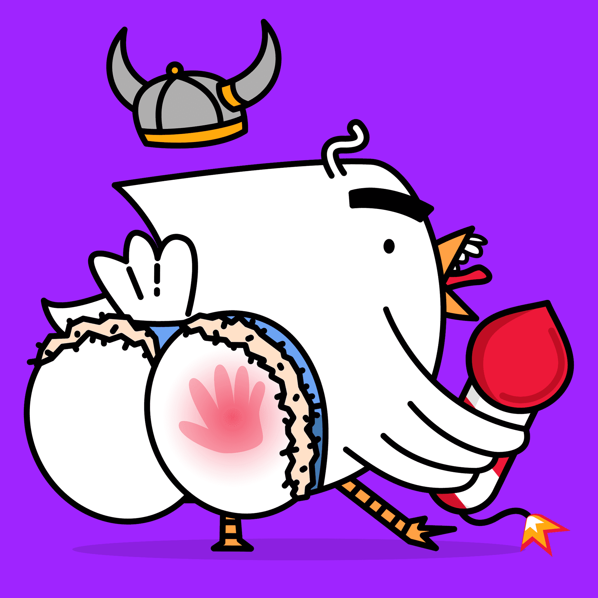

# Assplosion

Assplosion 是 5,000 只爆炸鸟的集合。当您获得一只鸟时，您将获得一次 ASSplosion 尝试。这意味着您可以尝试将随机鸟的屁股炸飞。

但冷静下来，你只会有50%的成功率，这意味着只有2500只鸟会爆炸（它们各自的艺术品会自动改变）。

Assplosion 是一个 NFT（不可替代令牌）集合。存储在区块链上的数字艺术品集合。

总共有 5,000 个 Assplosion NFT。目前，2,208 位所有者的钱包中至少有一个 Assplosion NTF。

Assplosion NFT 售出的最昂贵的价格是 . 它于 2022 年 6 月 8 日（3 个月前）以 180 美元的价格售出。

