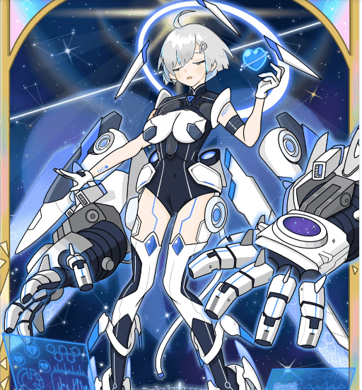

# ASTERISM Aurora

这是星座的集合。一天，与正在观测天体的“查勒”星座的精灵发生了奇迹般的相遇。为了保持这个“连接”雕刻成一个星座，我决定用区块链雕刻它。

不仅是 88 个星座 我们正在以“一个将继续存在的集合，就像有无数星星一样”来观察（创作作品）。无论如何，与星座的精神尝试成为朋友！

ASTERlSM 是一个 NFT（Non-fungible token）集合。存储在区块链上的数字艺术品集合。

总共有 69 个 ASTERlSM NFT。目前，84 位所有者的钱包中至少有一个 ASTERlSM NTF。

