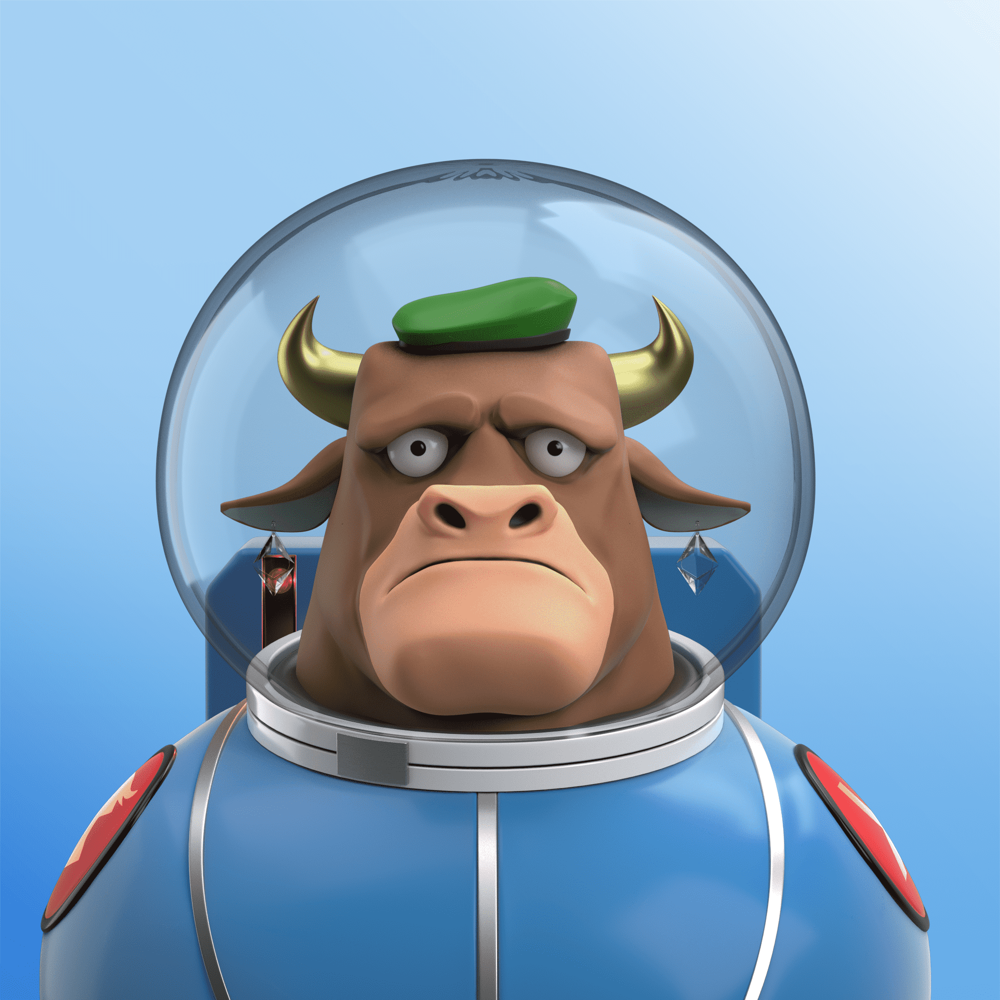

# Astro Frens

Astro Frens 是一个星际系列的通货紧缩 NFT 集合，结合在他们自己独特的元宇宙——Astroverse 中。

每只 Astro Bull 都是独一无二的，由超过 100,000 个按稀有度加权的可能结果以编程方式生成。特征包括角、服装、表情、眼睛、皮肤、头饰、背景等等！

第一代由10,000头生成的公牛组成。

多头作为 ERC-1155 代币存储在以太坊区块链上。

Astro Frens 俱乐部的会员钥匙是 Astro Bull。拥有 Astro Bull 可让您独家访问未来的 Astro Frens 掉落、参与 NFT 治理的权利以及路线图上规定的活动。拥有一头公牛，您就有能力塑造具有无限可能性的生态系统的未来。

