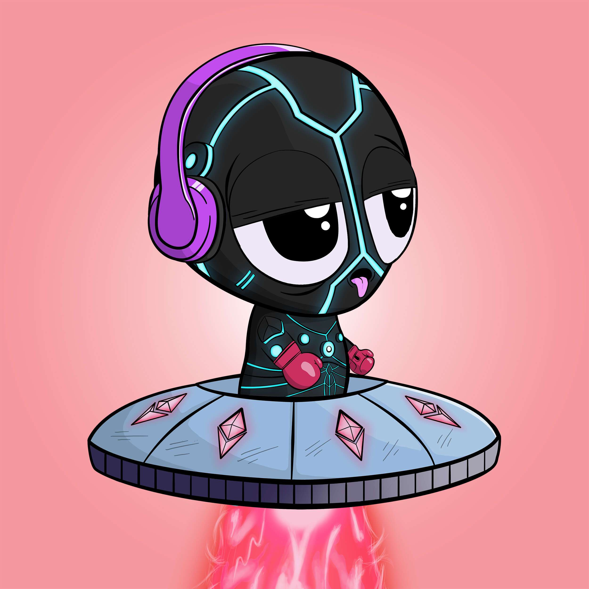

# AstroHeads

AstroHeads 是生活在以太坊区块链上的 8,851 个 AI 生成的收藏品的集合。AstroHeads 将尽职尽责地为他们幸运的主人服务，因为他们探索地球并从可爱的婴儿成长为具有独特（和高利润）特征的超级智能生物。

人类将他们从邪恶的创造者 Tzarkins 博士的魔掌中拯救出来！现在——正如他们的文化所要求的——永远感恩的 AstroHeads 向那些拯救他们的人宣誓义务。

地球上只有 8,851 只 AstroHeads 漫游，这些独特生物的所有权将保留给我们世界的精英......的高级任务。

AstroHeads 不仅将直接在 Klepton Inc 经济体系内为其所有者服务，还将兼任 Astro Inner Circle 的会员。访问取决于每个 AstroHead 的内在能力和教育水平。

