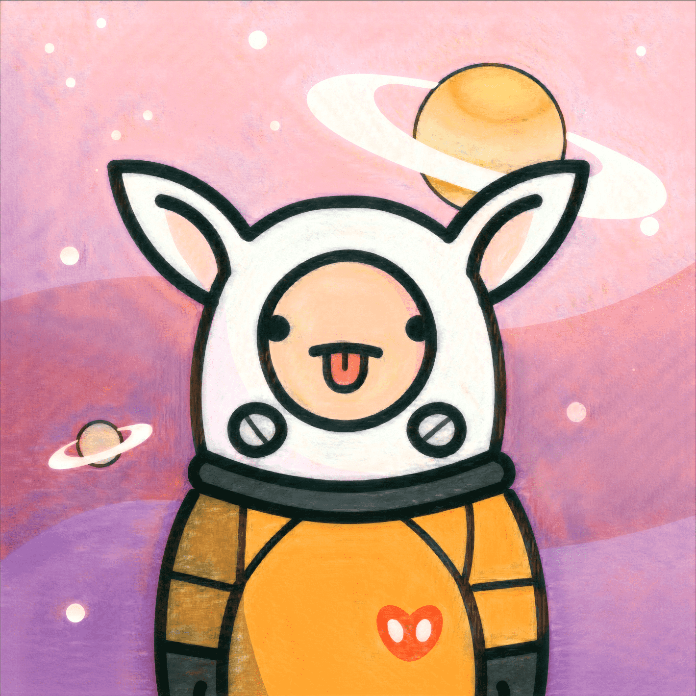

# AstroOTTO2001GENESIS

AstroOTTO 2001 是一个以“希望”为主题的 NFT 项目。2001 原创人物：太空先锋（AstroOTTO）并想创立品牌。这是一个与社区一起使其成为角色品牌的项目。

我们的目标是制作毛绒玩具、网络漫画、绘本、服装、虚拟世界资产等。

AstroOTTO BASE，一个漂浮在虚拟宇宙中的秘密基地。曾几何时，太空先驱 AstroOTTO 向历史上最伟大的人工智能 NATU 提出了一个问题。

AstroOTTO：“我想要快乐，我该怎么办？”我们继续寻找和探索各种星星。

