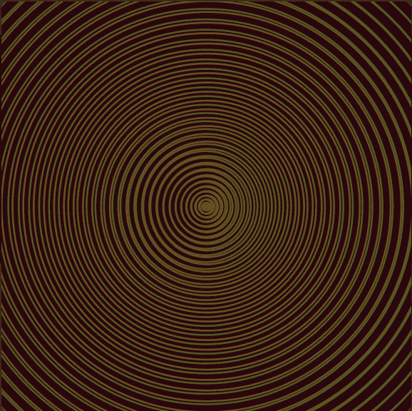

# Audioglyphs

Audioglyphs 是对音乐未来的一瞥，在这种情况下，艺术家不是发布静态录制的歌曲和限制访问，而是创造无限的变化，所有人都可以自由探索。

听众可以真正拥有一个独特的版本，而不是购买听音乐的权利。

我们计划开源 Audioglyphs 用于在网络上管理和嵌入音频处理的核心技术。

随着 Audioglyphs 的成功，我们计划继续为艺术家开发工具来创作和发布生成音乐。

从链上Pixelglyph数据派生的 10,000 个随机生成的无限音频 NFT。

每个 Audioglyph 都会直接在您的浏览器中以无损质量合成独特的无限音乐流。

音乐的未来
Audioglyphs 是对音乐未来的一瞥，在这种情况下，艺术家不是发布静态录制的歌曲和限制访问，而是创造无限的变化，所有人都可以自由探索。

听众可以真正拥有一个独特的版本，而不是购买听音乐的权利。

开放技术
我们计划开源 Audioglyphs 用于在网络上管理和嵌入音频处理的核心技术。

随着 Audioglyphs 的成功，我们计划继续为艺术家开发工具来创作和发布生成音乐。

碳中和
由 Offsetra 推动的印度卡纳塔克邦 Devarahipparigi 风力发电项目的捐款将抵消铸造产生的碳排放

