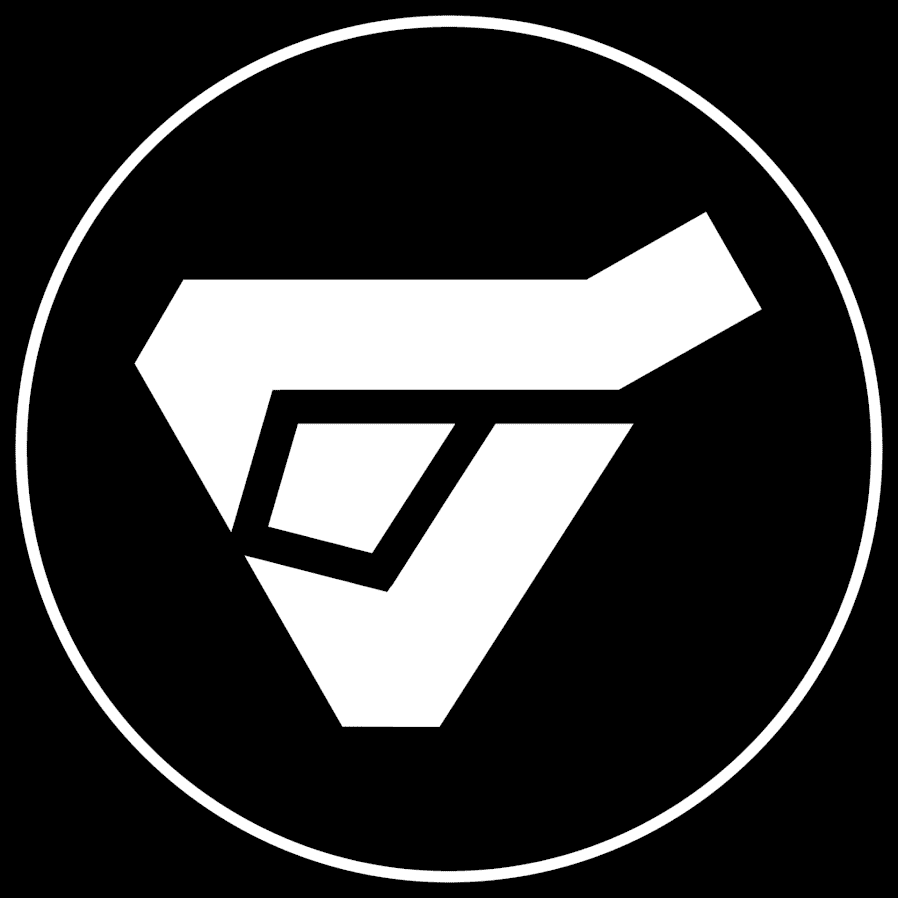

# Augminted Labs Scientists

Augminted Labs Scientists 是在以太坊区块链上铸造的无上限供应 NFT 集合，从名称到特征都可以完全定制。

科学家在 Kaiju Kingz 生态系统的扩展中发挥了作用，他们能够窃取 $SCALES，基于注入的 ETH，有机会窃取 DNA 和 $RWASTE。

科学家也将成为获得 alpha 访问权限和奖励的必要条件 - Monster x Monster

KaijuKingz 的科学家系列将于美国中部标准时间 2022 年 5 月 16 日星期一下午 6 点推出，铸造窗口为 48 小时。这些科学家将通过新的 P2E 机制启动 KaijuKingz 生态系统的扩展。科学家们将能够收集新的*$SCALES*代币，生成并有机会从剩余供应中获得 Baby Kaijuz，并有机会从 Mutant Kaijuz 那里窃取 DNA。

