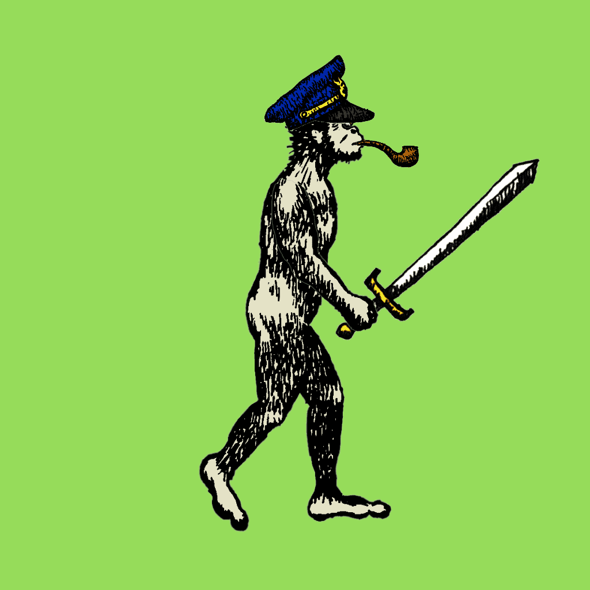

# Australopithecus NFT

不可替代的南方古猿。它们是从手绘插图转换为数字插图的 2,000 件具有收藏价值的独特艺术品。

Lucy Holders 可以收到即将到来的 Skeleton Lucy 和 Homo NFT

南方古猿 NFT NFT - 常见问题 (FAQ)
▶ 什么是南方古猿 NFT？
Australopithecus NFT 是一个 NFT（Non-fungible token）集合。存储在区块链上的数字艺术品集合。
▶ 存在多少南方古猿 NFT 代币？
总共有 1,956 个南方古猿 NFT NFT。目前，116 位所有者的钱包中至少有一个南方古猿 NFT NTF。
▶ 最近卖出了多少南方古猿 NFT？
过去 30 天内售出 0 个南方古猿 NFT NFT。

