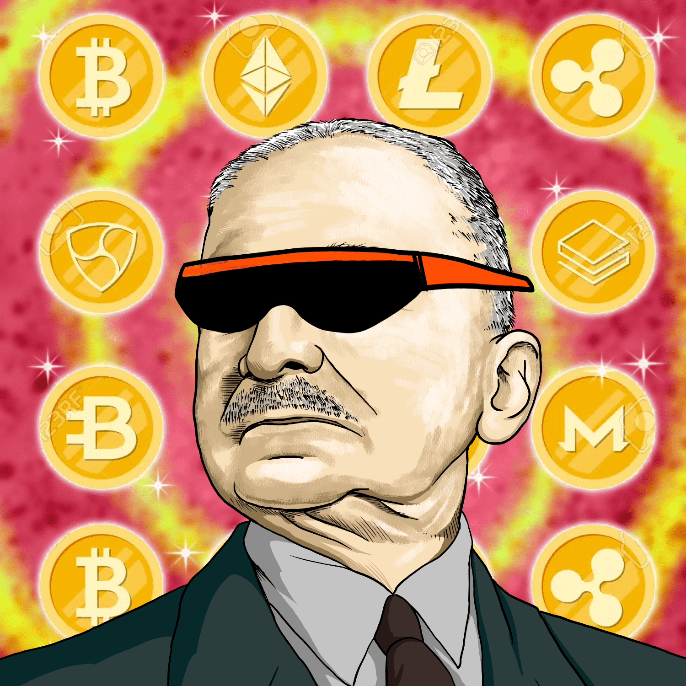

# Austrian Buddies

这个系列是为了纪念自由主义的伟大名字，它的灵感来自一些关于这个主题的最有价值的作家和思想家：米塞斯、庞巴维克、霍普、罗斯巴德、门格尔和哈耶克。这些人以任何方式为最自由的世界做出了贡献，不知何故，随着加密货币的出现，他们的书籍、试镜和想法，所以我想为世界做出贡献，永远记住他们。有 4000 个独特的奥地利好友 NFT，2000 个（编号 #4001 到 #6000）有两个副本。这个 NFT 让你 nft_owner 可以访问我们的不和谐服务器，只有所有者才能在某些聊天中交谈。

