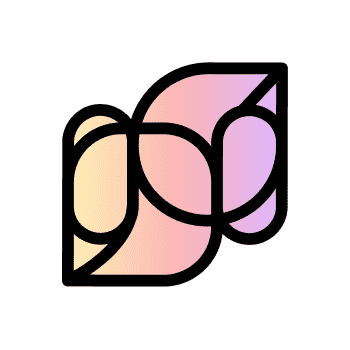

# AvantGarde Genesis

AvantGarde 是一个生成艺术项目，它通过深度学习算法和你的以太坊地址创建独特的艺术作品。为了评估抽象和 AI 生成的艺术品的价格，我们决定创建一个自动做市 (AMM)，以便代币价格遵循与代币供应反应的联合曲线。对于铸造和燃烧的每个代币，价格都会发生变化。

AvantGarde是由 Abricot Studio 打造的 NFT 体验，邀请您发现深度学习可以为艺术创作带来什么。它旨在将区块链和艺术生态系统联系起来，创造出具有创造性和抽象性的、完全个性化和独特的艺术作品。

