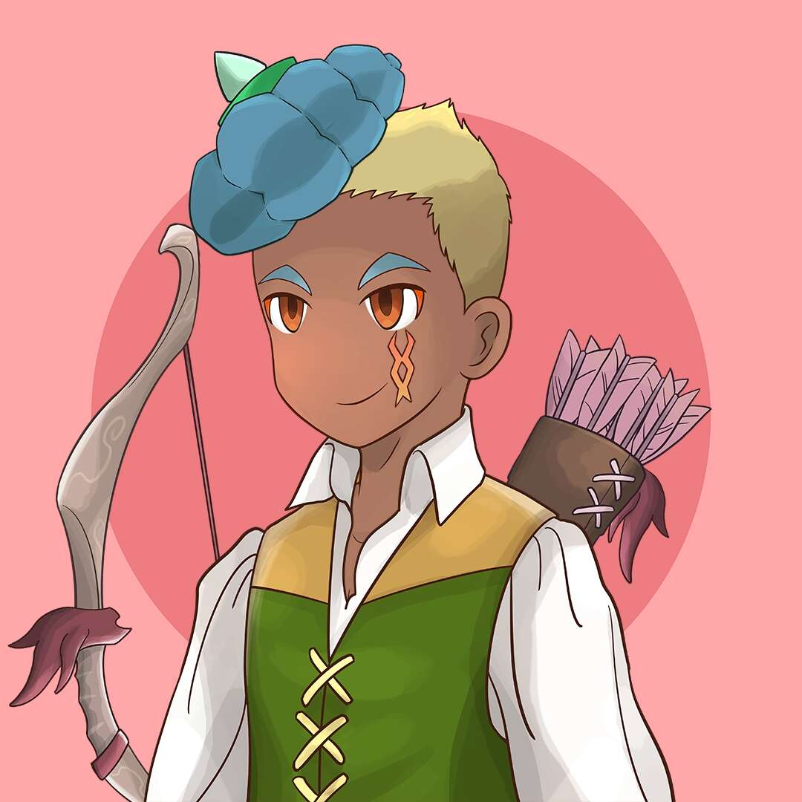

# Avarik Saga Universe

Avarik Saga 是 8,888 个生成 NFT 角色的骑士、弓箭手和巫师的旅程，这些角色源自 4 个冲突派系的 300 多个独特手绘特征。

在这些中世纪的土地上流传着一个传说，一位英雄将带领他们的派系取得胜利，并停止活跃的伊格尼斯、仁慈的泰拉、流动的冰川和神秘的泰尼布里斯之间无休止的战争。

Avarik Saga是8,888 个生成 NFT 角色的编年史， 描绘了来自 4 个相互冲突的派系的骑士、弓箭手和巫师，每个派系都是400 多个独特手绘特征的独特组合。

战争将曾经繁荣的阿瓦里克王国撕成一片充满暴力和绝望的土地。现在有传言称，一位英雄将很快崛起，带领他们的派系取得胜利，最终结束了好斗的伊格尼斯、仁慈的泰拉、流动的冰川和神秘的泰尼布里斯之间无休止的战斗。

