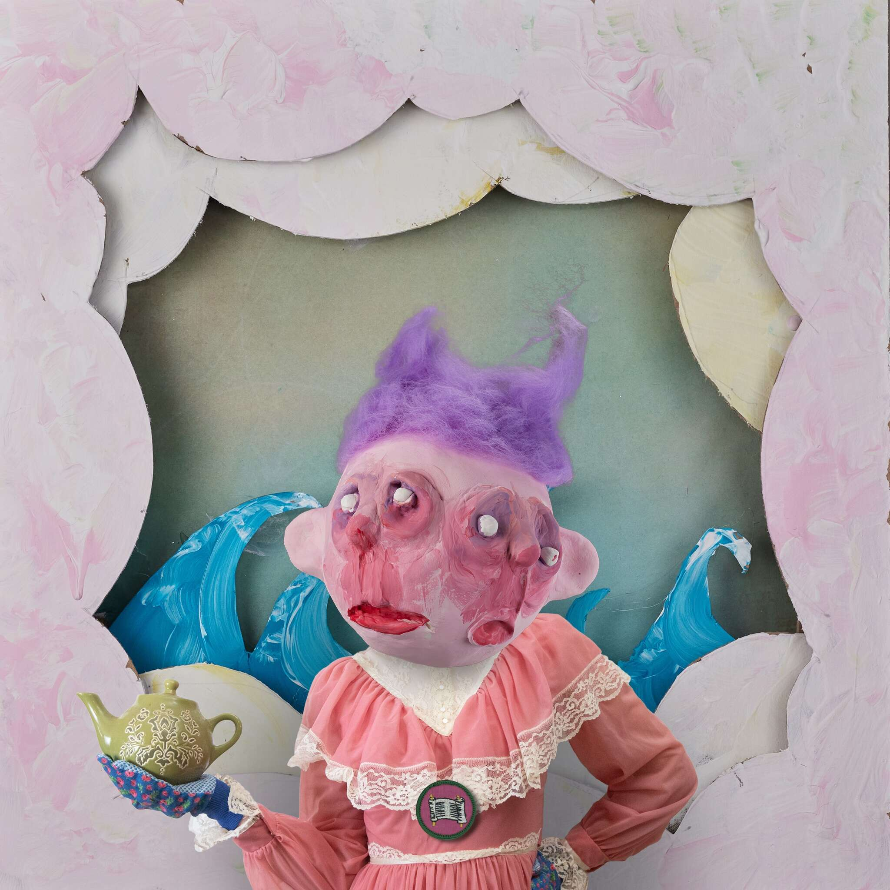

# Average Creatures

Average Creatures 是区块链上第一个全手工雕塑/摄影 NFT PFP 混合系列。

没错，每一件都是手工制作并单独拍摄的。受到 80 年代艺术、媒体和娱乐的所有实际效果荣耀的启发，Average Creatures 向现在如此遥远的历史时代致敬：我们的童年。

该系列中的每个平均生物都是数百个元素和层组合的策划结果，这些元素和层被拍摄并合成在一起，形成了一个独特的作品。这个项目混合了几种艺术技术来创造一种打破常规的视觉风格，探索了尚未在任何其他 PFP 项目中一起使用的传统艺术形式。从布景设计到雕刻，从服装到绘画，每个“平均生物”都有鲜明的个性，真正重新定义了我们对“平均”这个词的看法。

