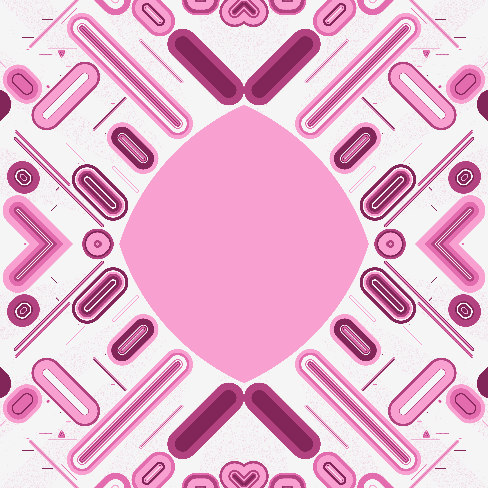

# Avid Lines

该项目是关于 NFT 中可组合性的实验。这些碎片是在薄荷上生成的，使用来自 Autoglyphs 的指令和随机特征。选择 Autoglyphs 是因为它们是第一个也是最重要的生成艺术项目，完全包含在链上，允许更深层次的可组合性。从同一个生成器生成的两个部分将不相等。艺术品由精心分布在画布上的线条组成。这个项目是对圆端线条和混乱复杂性的颂歌。它的灵感来自微观自然和运动。

